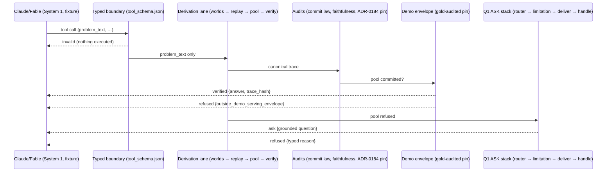

# Claude → CORE Hybrid Verification Demo

A narrow, auditable proof path for one claim:

```text
Claude/Fable proposes.
CORE validates.
CORE verifies/refuses/asks.
The trace proves.
```

A frontier LLM acts as a **System 1 semantic proposer** — it decides *what to
ask* and frames a bounded reasoning task as a typed tool call.  CORE acts as a
**deterministic System 2 verifier/executor** — it re-derives everything itself,
keeps sole acceptance authority, refuses or asks when it cannot honestly answer,
and emits a deterministic, replayable trace for every decision.  The proposer
has **no execution authority and no commit path**: there is no field in the tool
schema through which an answer, a derivation, or an acceptance decision could
travel, and the response's `authority_path` names every decider — the proposer
appears nowhere in it.

"System 1/System 2" is used here as framing for the boundary, not as
established CORE vocabulary.  The protocol posture follows ADR-0140 (proposed;
ecosystem protocols such as MCP stay at the perimeter as boundary adapters) and
ADR-0018 (accepted; CORE does not become a host for external tools, and no CORE
operator calls a stochastic model): the tool contract is **MCP-shaped** for perimeter
compatibility, served by a local script — it is a proof of the boundary, not a
production MCP server.

## What is real CORE here

* **The derivation lane, end to end.**  `problem_text` runs live through the
  ADR-0184 semantic-state worlds (`generate/derivation/state/source.py`), the
  replay bridge, the cross-composer candidate pool (`generate/derivation/pool.py`),
  and the self-verification gates (`generate/derivation/verify.py`).  Nothing is
  pre-computed: the engine re-derives on every call, and the committed expected
  artifacts only *check* the result.
* **The audit layer.**  Every executed derivation runs the ADR-0184 S4b checks
  live (an `invalid` payload executes nothing, by design):
  `authority_violations` (the pool's commit law re-derived from trace data) and
  `replay_faithfulness_report` (every candidate tied 1:1 to its semantic world).
  For problems inside the ADR-0184 equivalence corpus the live trace is also
  compared against the frozen `evals/gsm8k_math/equivalence/v1` reference
  (`replay_equivalence_status`).
* **The ASK stack.**  The ask leg is the real Q1 epistemic-disclosure chain:
  organ routing (`core/comprehension_attempt/router.py`) → limitation
  classification (`core/epistemic_disclosure/limitation.py`) → grounded-only
  rendering and delivery (`core/epistemic_questions/delivery.py`, which writes a
  content-addressed artifact) → the carried-handle serving seam
  (`core/epistemic_disclosure/ask_handle.py` → `ask_acquisition` →
  `ask_serving`).  The question text is produced by CORE's wrong=0-guarded
  renderer during the run — never authored by the demo, never by the proposer.
* **Determinism.**  `run_demo.py` executes every scenario twice through fresh
  output directories and requires byte-identical responses; `trace_hash` is the
  SHA-256 of the canonical response envelope.

## What is simulated

* **The System 1 side.**  Scenario payloads in `scenarios.jsonl` are clearly
  labeled, committed **Claude/Fable-style System 1 proposal fixtures**.  No
  model API is called, no network is used, and no API key is required.  (A live
  proposer would change nothing on the System 2 side: the boundary validates
  payloads, not their author.)

## What is deliberately NOT claimed

* **The off-serving derivation pool is not a wrong=0 oracle over arbitrary
  text.**  Measured on the 937-problem ADR-0184 equivalence corpus: the pool
  commits 231 resolutions, and 118 of them disagree with lane gold (dominated
  by rate/unit-price mis-reads — `each`/`per`/`for` cues — plus fraction,
  percent, and multi-entity-total shapes whose soundness gates pass while the
  reading is wrong).  CORE's committed wrong=0 claims are *lane-scoped and
  sealed* (see `CLAIMS.md`); this demo therefore adds its own fail-closed gate
  on top of the pool rather than borrowing those claims:

  > `status: "verified"` requires a pool commit **and** clean commit-law and
  > faithfulness audits **and** an entry in the committed, gold-audited
  > `envelope.json` **and** a byte-identical match between the live derivation
  > trace and the envelope's pinned reference.

  Scenario `s4` exists to make this visible: the pool commits an answer that
  happens to match gold, and the demo still refuses
  (`outside_demo_serving_envelope`), because an unaudited commit served as
  "verified" would be a false epistemic status.  This is a **bounded
  transition / verification guarantee** over the audited envelope — not an
  absolute safety guarantee and not a general math-capability claim.
* **No production MCP.**  The schema is MCP-shaped; there is no server, no
  transport, no session management, and no claim of MCP production readiness.
* **No runtime/serving change.**  The public chat runtime, CLAIMS, metrics,
  telemetry schema, runtime schema, and lane pins are untouched.  The ASK
  serving gate stays dark by default repo-wide; this demo enables it only
  through its own local config object passed to the seam.

## The five scenarios

| id | status | what it proves |
| --- | --- | --- |
| `s1-verified-grounded-chain` | `verified` | A grounded gain/loss chain commits (26 dollars), the envelope authorizes it, and the live trace byte-matches both the demo pin and the ADR-0184 corpus pin. |
| `s2-refused-disagreement` | `refused` | Two self-verifying readings derive 24 and 36 — **both wrong** (gold 12).  The disagreement rule refuses both instead of guessing. |
| `s3-ask-missing-total` | `ask` | The pool refuses; R2 identifies the missing total count; the Q1 stack renders, delivers, and serves a grounded question through the content-hash-verified handle seam. |
| `s4-refused-outside-envelope` | `refused` | A pool commit **outside the audited envelope** is refused even though it happens to match gold — no false epistemic status. |
| `s5-invalid-answer-smuggling` | `invalid` | A payload carrying `proposed_answer`/`confidence` is rejected at the typed boundary; no derivation executes. |

## Running

```bash
UV_PROJECT_ENVIRONMENT=/tmp/core-hybrid-demo-uv uv run \
    python demos/claude_hybrid_verification/run_demo.py
```

Each scenario is run twice; the run fails on any determinism break, drift from
`expected/*.json`, or status mismatch.  `--json` emits the machine summary;
`--update-expected` re-pins the reference artifacts (the diff is the audit
trail — never re-pin a failure you cannot explain).

## The handoff, end to end



## Files

* `tool_schema.json` — the MCP-shaped tool definition (`core.semantic_derivation.verify`).
* `schema.py` — typed payload validation, interpreted from the schema file itself.
* `verify_tool.py` — the System 2 boundary (imports **nothing from `generate.*`**;
  the derivation lane is reached only through the audited ADR-0184 trace facade).
* `envelope.json` — the gold-audited serving envelope (what may be served as verified).
* `scenarios.jsonl` — the committed System 1 proposal fixtures.
* `expected/*.json` — pinned deterministic response artifacts (the screenshot/log
  excerpts, and the replay reference).
* `run_demo.py` — the local runner (double-run determinism + pin verification).

Tests: `tests/test_claude_hybrid_verification_demo.py` proves the no-bypass
properties (schema rejection, envelope fail-closure, tamper detection on the
pool facade and on the question artifact, determinism, structural import
allowlist, and the gold re-audit of every envelope entry).
