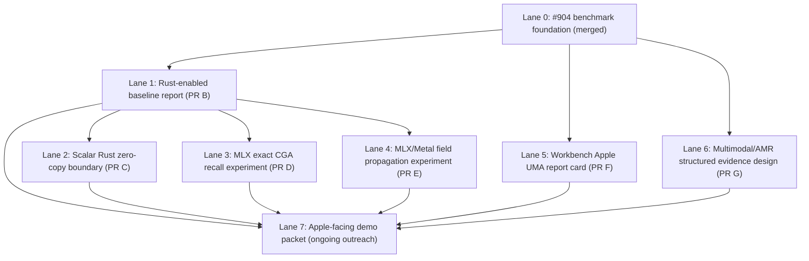

# ADR-0235: Apple Silicon UMA Acceleration Lanes

**Status:** Proposed

**Date:** 2026-06-24

**Scope:** Apple Silicon mechanical sympathy benchmark roadmap, native backend
baseline, optional MLX/Metal exploratory lanes, Workbench evidence surfaces,
multimodal/AMR structured-evidence benchmark design

**Depends on:**

- Merged PR #904 (`feat(bench): Apple Silicon UMA mechanical sympathy benchmark`)
- `docs/outreach/apple-silicon-support-brief.md`
- `benchmarks/apple_uma_mechanical_sympathy.py`
- `algebra/backend.py` (Python semantic source of truth; Rust incumbent native path)
- ADR-0054 vault recall indexing/batching doctrine (exact recall, no ANN)
- ADR-0222 FrameVerdict closed-world proof surface

## 1. Summary

PR #904 established a **claim-safe, reproducible Apple Silicon UMA mechanical
sympathy benchmark** for CORE.  That harness is the **foundation**, not the
final Apple-engineering demo.  This ADR defines a **staged PR stack** that
moves from measured evidence to optional acceleration experiments **without**
violating CORE semantic, proof, replay, governance, or serving invariants.

Python remains the **semantic source of truth**.  Rust remains the **incumbent
native algebra backend**.  MLX and Metal are **exploratory acceleration lanes**
until separate parity gates promote anything.  CoreML/ANE are **non-claims**
unless implemented, parity-tested, and measured.

Each lane is **benchmark-only or documentation-only** until explicitly
authorized for serving.  No lane may mutate serving behavior, response
governance, reliability gates, pack ratification, epistemic disclosure, or
teaching/review behavior.

## 2. Current State After #904

### 2.1 What shipped

| Artifact | Role |
|---|---|
| `benchmarks/apple_uma_mechanical_sympathy.py` | Deterministic benchmark harness (tracks A–F) |
| `tests/test_apple_uma_mechanical_sympathy_benchmark.py` | Claim-safety and track contract tests |
| `core/cli.py` (`core bench --suite apple-uma`) | CLI entry for JSON/report emission |
| `evals/reports/apple_uma_mechanical_sympathy_latest.{json,md}` | Seed reproducible report |
| `docs/outreach/apple-silicon-support-brief.md` | Engineering-first outreach brief |

### 2.2 Tracks implemented in #904

| Track ID | Workload | Backend today |
|---|---|---|
| `cl41_scalar_ops` | `geometric_product`, `versor_apply`, `cga_inner`, `versor_condition` | Python or Rust via `algebra.backend` |
| `exact_cga_recall` | Exact top-k CGA recall on `(N, 32)` float32 matrices | Python vectorised scan or Rust `vault_recall` |
| `diffusion_step` | One diffusion step on ring graph | Rust only; skipped when `core_rs` unavailable |
| `frame_verdict_ttfv` | Closed-world FrameVerdict time-to-first-verifiable-verdict | Python `evaluate_frame_verdict` (off-serving) |
| `array_codec_replay` | Deterministic encode/decode persistence replay | Python `core.array_codec` |
| `claim_safety_audit` | Safe claims, non-claims, copy paths, future work | Static + dynamic from `using_rust()` |
| `copy_zero_copy_truth_table` | Honest memory-boundary table | Static + dynamic from `using_rust()` |

### 2.3 Known honest limits recorded by #904

- Local seed report may use **Python backend** when `core_rs` is not installed.
- Scalar Rust helpers **copy** inputs via `extract_f32_slice` list conversion.
- `array_codec` copies through base64; not a zero-copy persistence path.
- MLX, Metal, CoreML, and Neural Engine are listed as **future work** in the
  claim safety audit — not measured claims.
- No token-generation, ANN, HNSW, or approximate-recall benchmarks.

### 2.4 Why #904 is foundation, not final demo

#904 answers: *what is implemented, what is measured, what is skipped, what
copy boundaries exist, and what must not be claimed*.  An Apple-engineering-grade
demo additionally requires:

1. Rust-enabled native baseline reports on arm64 CI or hardware with `core_rs`.
2. Scalar copy-boundary cleanup where parity-safe.
3. Optional MLX/Metal experiments with explicit parity oracles.
4. Workbench read-only evidence surfacing (no fake defaults).
5. Multimodal/AMR structured-evidence throughput design (not opaque model quality).
6. Outreach packet that remains engineering-first and claim-safe.

## 3. Lane Map Overview



**Merge ordering (separate PRs; do not squash stages):**

| Order | Branch | ADR section |
|---|---|---|
| A (this ADR) | `feat/apple-uma-acceleration-roadmap` | §3–§12 |
| B | `feat/apple-uma-rust-baseline-report` | Lane 1 |
| C | `feat/rust-scalar-cl41-zero-copy-boundary` | Lane 2 |
| D | `feat/apple-mlx-exact-cga-recall-experiment` | Lane 3 |
| E | `feat/apple-mlx-field-propagation-experiment` | Lane 4 |
| F | `feat/workbench-apple-uma-report-card` | Lane 5 |
| G | `feat/multimodal-amr-structured-evidence-benchmark-design` | Lane 6 |

Lanes D and E may proceed in parallel after B.  Lane C should precede or
inform D/E copy-boundary reporting.  Lane F may start after A; it only reads
reports.  Lane G is documentation/fixture design and does not require Rust or
MLX.

## 4. Lane Specifications

Each lane table uses the same columns:

- **SoT** — semantic source of truth
- **Backend** — implementation backend under test
- **Fixtures** — deterministic fixture requirements
- **Parity oracle** — what proves correctness
- **Copy boundary** — honest copy/zero-copy characterization
- **Measurement** — what the benchmark reports
- **Skipped mode** — fail-closed behavior when unavailable
- **Serving** — whether serving-authorized (all lanes: **no** until separate ADR)
- **Benchmark-only** — whether confined to benchmark/eval surfaces
- **Risks** — primary hazards
- **Tests** — required validation suite

---

### Lane 0 — Benchmark foundation (#904, merged)

| Field | Value |
|---|---|
| **SoT** | Python `algebra/*`, `vault/store.py` recall semantics, `generate/frame_verdict/*`, `core/array_codec` |
| **Backend** | `algebra.backend` dispatch (Python default; Rust when `CORE_BACKEND=rust` and `core_rs` installed) |
| **Fixtures** | `synthetic_mv`, `synthetic_matrix`, `synthetic_ring_edges`, `deterministic_closed_frame` — fixed formulas, no unseeded RNG |
| **Parity oracle** | Deterministic repeat checks per track; `versor_condition` invariant preserved by construction boundaries |
| **Copy boundary** | `copy_zero_copy_truth_table` and per-track `memory_note` / `memory_behavior` |
| **Measurement** | p50/p95/min/max/mean timing, ops/sec or rows/sec, skipped reasons, machine metadata |
| **Skipped mode** | `diffusion_step` skipped with explicit reason when Rust unavailable; large-N recall probe skipped on time budget |
| **Serving** | **No** — off-serving benchmark only |
| **Benchmark-only** | **Yes** |
| **Risks** | Over-claiming from Python-only reports; absolute paths in metadata (fixed in #904 patch) |
| **Tests** | `tests/test_apple_uma_mechanical_sympathy_benchmark.py`, `core bench --suite apple-uma` |

---

### Lane 1 — Rust-enabled Apple UMA baseline report (PR B)

| Field | Value |
|---|---|
| **SoT** | Python `algebra/backend.py` dispatch semantics unchanged |
| **Backend** | Rust `core_rs` via `CORE_BACKEND=rust`; Python fallback retained |
| **Fixtures** | Same as Lane 0; no new fixtures required |
| **Parity oracle** | Existing Rust parity tests for `vault_recall`, `diffusion_step`; benchmark `result_deterministic` flags |
| **Copy boundary** | Report must show `using_rust(): true`, unskipped `diffusion_step`, Rust zero-copy eligibility on recall |
| **Measurement** | Regenerated `evals/reports/apple_uma_mechanical_sympathy_latest.{json,md}` on arm64 with `core_rs` |
| **Skipped mode** | If `core_rs` unavailable locally, **do not fake** — document setup commands; CI arm64 job may publish report |
| **Serving** | **No** |
| **Benchmark-only** | **Yes** |
| **Risks** | Publishing Python report labeled as native; missing `diffusion_step` conflated with "Apple Silicon limit" |
| **Tests** | `tests/test_apple_uma_mechanical_sympathy_benchmark.py`; helper asserting clean Rust detection |

**Deliverables:** setup documentation (env vars, `cargo`/maturin install path), optional CI note, clearer skipped/native status in report metadata.  **No scalar binding edits.**

---

### Lane 2 — Scalar Rust zero-copy boundary cleanup (PR C)

| Field | Value |
|---|---|
| **SoT** | Python implementations in `algebra/` remain canonical semantics |
| **Backend** | Rust bindings in `core-rs/src/lib.rs` for `geometric_product`, `cga_inner`, `versor_condition`; `versor_apply` only if closure-stable |
| **Fixtures** | Exact 32-component `float32` contiguous inputs; wrong shape/dtype cases for failure tests |
| **Parity oracle** | Byte-level or tight float tolerance parity vs Python backend on fixed fixtures; `versor_condition(F) < 1e-6` after `versor_apply` paths |
| **Copy boundary** | `PyReadonlyArray1` zero-copy on eligible inputs; loud failure on wrong shape/dtype — no silent coercion |
| **Measurement** | Updated `cl41_scalar_ops` timings and truth-table rows reflecting reduced copy tax |
| **Skipped mode** | Python fallback unchanged when Rust unavailable or input ineligible |
| **Serving** | **No** until separate serving authorization ADR |
| **Benchmark-only** | **Yes** for promotion; backend change affects runtime dispatch only after explicit authorization |
| **Risks** | Parity drift; silent dtype coercion; breaking `versor_apply` closure; hot-path repair outside `algebra/versor.py` |
| **Tests** | Rust parity tests, wrong-shape/dtype tests, closure tests, fallback tests, `test_apple_uma_mechanical_sympathy_benchmark.py`, `cargo test` |

**Stop rule:** if zero-copy work is non-trivial or closure-unstable, defer and document gap — do not weaken invariants.

---

### Lane 3 — MLX exact CGA recall experiment (PR D)

| Field | Value |
|---|---|
| **SoT** | Python/Rust exact `vault_recall` / `cga_inner` ranking — MLX is **not** semantic backend |
| **Backend** | Optional `mlx` array ops on Apple Silicon GPU/CPU; benchmark track `mlx_exact_cga_recall` |
| **Fixtures** | Deterministic `(N, 32)` float32 matrices matching #904 `synthetic_matrix`; same `top_k` and query MV |
| **Parity oracle** | Identical top-k index ordering vs Python/Rust exact recall on same fixtures |
| **Copy boundary** | Explicit copy-in (NumPy→MLX) and copy-out (MLX→NumPy) reporting; no "zero-copy everywhere" claim |
| **Measurement** | MLX import status, device/stream if observable, CPU/GPU mode, shape/dtype/contiguity, p50/p95, rows/sec, parity pass/fail |
| **Skipped mode** | `skipped: true` with `reason` when `mlx` import fails or device unavailable; tests cover skip path |
| **Serving** | **No** |
| **Benchmark-only** | **Yes** |
| **Risks** | Approximate ops smuggled as exact; hidden normalization; non-deterministic GPU scheduling; semantic backend confusion |
| **Tests** | `tests/test_apple_uma_mechanical_sympathy_benchmark.py` with monkeypatched unavailable MLX; parity test when MLX present |

**Non-claim:** MLX acceleration does not replace Python semantics or authorize serving recall.

---

### Lane 4 — MLX/Metal field propagation experiment (PR E)

| Field | Value |
|---|---|
| **SoT** | Python/Rust `diffusion_step` semantics on deterministic ring (or fixed) graphs |
| **Backend** | Optional MLX; Metal custom kernels only as isolated low-level follow-up after MLX learning |
| **Fixtures** | `(N, 32)` fields, `(E, 2)` int32 edges, fixed damping — same generators as #904 |
| **Parity oracle** | Numeric parity vs Rust `diffusion_step` where available; max abs delta reported |
| **Copy boundary** | Input copy-in, owned output copy-out documented per run |
| **Measurement** | nodes, edges, damping, input/output bytes, device/stream, p50/p95, parity error, skipped reason |
| **Skipped mode** | Skip when MLX unavailable or Rust parity baseline unavailable for oracle |
| **Serving** | **No** |
| **Benchmark-only** | **Yes** |
| **Risks** | Claiming full CORE runtime acceleration; drift from `field/propagate.py` serving path; numeric tolerance masking bugs |
| **Tests** | Benchmark track tests, skip-path tests, parity test when MLX+Rust available |

**Non-claim:** This is a CORE-*like* contiguous propagation workload experiment, not serving field propagation.

---

### Lane 5 — Workbench Apple UMA report card (PR F)

| Field | Value |
|---|---|
| **SoT** | Read-only parse of `evals/reports/apple_uma_mechanical_sympathy_latest.json` |
| **Backend** | Workbench UI (TypeScript/React); no rerun unless existing safe deterministic CLI hook |
| **Fixtures** | Checked-in sample report JSON for component tests; live file read at runtime |
| **Parity oracle** | UI fields match report JSON keys; missing file renders `missing_evidence` |
| **Copy boundary** | N/A (read-only display) |
| **Measurement** | Display only — machine/backend summary, tracks, recall highlights, TTFV, codec replay, truth table, audit |
| **Skipped mode** | Missing report → honest empty state; no fabricated defaults |
| **Serving** | **No** |
| **Benchmark-only** | **Yes** (evidence cockpit) |
| **Risks** | Marketing UI; implied rerun mutating reports; stale report presented as live serving metric |
| **Tests** | `workbench-ui` component tests; `pnpm build` |

---

### Lane 6 — Multimodal/AMR structured-evidence benchmark design (PR G)

| Field | Value |
|---|---|
| **SoT** | Sensorium compiler substrates (ADR-0181 audio, vision fixtures), deterministic evidence records |
| **Backend** | Design-time only; optional tiny synthetic fixture generator |
| **Fixtures** | Deterministic image/audio/text/sensor metadata → perceptual evidence record; no model downloads, no network, no LLM |
| **Parity oracle** | Replay-stable trace hashes; structured graph equality; FrameVerdict/proof surface on closed fixtures |
| **Copy boundary** | Document UMA-aligned contiguous buffers per modality compiler unit |
| **Measurement** | Structured evidence transformation throughput and proof latency — **not** recognition quality |
| **Skipped mode** | N/A at design stage; future benchmark lanes skip unavailable modalities with explicit reasons |
| **Serving** | **No** |
| **Benchmark-only** | **Yes** (future benchmark module) |
| **Risks** | Opaque multimodal model claims; conflating perception quality with geometric proof throughput |
| **Tests** | `tests/test_architectural_invariants.py`; future lane-specific tests when implemented |

**Pipeline shape (target):**

```text
image/audio/text/sensor fixture
  → deterministic perceptual evidence record
  → AMR / scene graph / relation graph
  → geometric binding matrix
  → exact recall / residual search
  → FrameVerdict / proof surface
  → Workbench trace
```

---

### Lane 7 — Apple-facing demo packet (outreach, ongoing)

| Field | Value |
|---|---|
| **SoT** | Merged artifacts: benchmark harness, latest report, Workbench card, outreach brief |
| **Backend** | Documentation and reproducible CLI commands only |
| **Fixtures** | Public report JSON/MD under `evals/reports/` |
| **Parity oracle** | Report checksum pinned in brief; reproduce commands documented |
| **Copy boundary** | Brief cites truth table — no blanket zero-copy claim |
| **Measurement** | Narrative ties evidence to lanes actually run on demo hardware |
| **Skipped mode** | Brief states skipped tracks explicitly (e.g. Rust, MLX) |
| **Serving** | **No** |
| **Benchmark-only** | **Yes** |
| **Risks** | Apple endorsement implication; Siri/product integration claim; sponsorship speedup multiplier |
| **Tests** | Manual review checklist; `git diff --check` on brief updates |

**Demo narrative (authorized framing):**

> CORE is a deterministic Cl(4,1) reasoning and safety architecture.  Its workload
> is not token generation.  It is exact geometric recall, replay-stable evidence,
> closed-world proof verdicts, and structured field propagation.  Apple Silicon UMA
> is relevant because these are contiguous-memory geometric workloads where native
> copy boundaries matter.  This benchmark shows what is implemented, what is measured,
> what is skipped, what is future work, and what larger Apple Silicon hardware would
> unlock.

## 5. Explicit Non-Goals and Non-Claims

The acceleration stack **must not**:

1. Replace Python as semantic source of truth with MLX, Metal, or CoreML.
2. Wire MLX/Metal paths into serving, vault recall, or `field/propagate.py` hot paths without separate authorization ADR.
3. Remove Python/Rust fallbacks in this roadmap tranche.
4. Introduce approximate recall, ANN, HNSW, cosine shortcuts, or hidden normalization.
5. Benchmark token generation or transformer throughput.
6. Claim "zero-copy everywhere" or a fixed sponsorship speedup multiplier.
7. Claim Apple endorsement, partnership, sponsorship, or product integration (Siri, etc.).
8. Mutate GSM8K serving, reliability gates, teaching/review, pack ratification, or epistemic disclosure.
9. Add stochastic sampling, unseeded RNG, or network/model dependencies to benchmark lanes.
10. Present Workbench UI as a live serving dashboard.

## 6. Required Parity Gates

Any lane that introduces a new implementation backend must pass **all** applicable
gates before its results appear in `safe_claims`:

| Gate | Requirement |
|---|---|
| **G1 Semantic lock** | Python reference implementation unchanged; new backend is acceleration only |
| **G2 Determinism** | Same fixtures → same outputs (indices, hashes, or bounded numeric tolerance documented) |
| **G3 Fail-closed skip** | Unavailable backend → `skipped: true` + explicit `reason`; no silent fallback posing as accelerated |
| **G4 Copy honesty** | Truth table and track metadata updated; no zero-copy claim without eligibility checks |
| **G5 Invariant preservation** | `versor_condition(F) < 1e-6` on applicable paths; no hot-path repair |
| **G6 Claim audit** | `claim_safety_audit.safe_claims` only lists what actually ran; `unsafe_claims_not_made` unchanged in spirit |
| **G7 Serving firewall** | No import from benchmark modules into `chat/`, `core/cognition/`, `vault/store.py` serving paths |
| **G8 Report reproducibility** | `uv run python -m benchmarks.apple_uma_mechanical_sympathy --write-report` reproduces structure |

Numeric tolerance (Lane 4 only): must be documented per fixture with max abs delta;
tolerance widening requires ADR amendment.

## 7. Required Tests (per lane)

| Lane | Minimum test command |
|---|---|
| 0 (#904) | `uv run python -m pytest -q tests/test_apple_uma_mechanical_sympathy_benchmark.py` |
| 1 (PR B) | Above + Rust detection helper test |
| 2 (PR C) | Above + `tests/test_*rust*` / algebra parity + `cargo test --manifest-path core-rs/Cargo.toml` |
| 3 (PR D) | Above + MLX skip-path + optional MLX parity test |
| 4 (PR E) | Above + MLX/Metal skip-path + optional numeric parity test |
| 5 (PR F) | `cd workbench-ui && pnpm test -- <report card tests> && pnpm build` |
| 6 (PR G) | `uv run python -m pytest -q tests/test_architectural_invariants.py` |
| All doc PRs | `git diff --check` |

**Architectural invariants** (`tests/test_architectural_invariants.py`) must remain green
across every PR — especially INV-02 (no hot-path normalization) and recall exactness.

## 8. MLX / Metal / CoreML Stance

| Technology | Role | Authorization |
|---|---|---|
| **MLX** | Exploratory Apple Silicon GPU/CPU array acceleration for benchmark tracks | Benchmark-only until G1–G8 pass and serving ADR exists |
| **Metal** | Lower-level kernel follow-up after MLX experiments inform parity and copy boundaries | Isolated experiment modules only |
| **CoreML / ANE** | Future work | **Non-claim** until implemented, parity-tested, measured, and documented |

MLX is **not** a replacement for the semantic source of truth.  Metal custom kernels
are a **lower-level follow-up** only after MLX/parity learning.  Multimodal tracks
benchmark **structured evidence throughput**, not opaque model output quality.

## 9. Apple Silicon UMA Relevance (engineering, not marketing)

CORE workloads relevant to UMA mechanical sympathy:

- Contiguous `(N, 32)` float32 geometric matrices for exact recall.
- Cl(4,1) scalar ops with predictable memory access patterns.
- Field propagation on dense node buffers with explicit edge lists.
- Deterministic persistence replay across unified memory without hidden copies.

UMA advantage is **conditional** on measured copy boundaries — reported honestly in
`copy_zero_copy_truth_table`, not assumed from hardware marketing materials.

## 10. Validation For This ADR (PR A)

This PR touches **documentation only**.  Required validation:

```bash
git diff --check
uv run python -m pytest -q tests/test_architectural_invariants.py
```

## 11. Merge Blockers

**PR A (this ADR)** must not merge if:

- it edits runtime backend code, Rust bindings, MLX imports, or Workbench UI;
- it claims MLX/Metal/CoreML as implemented acceleration;
- it authorizes serving integration for any lane; or
- validation commands in §10 fail.

**Downstream implementation PRs** must not merge if:

- parity gates in §6 are skipped;
- benchmark modules are imported from serving hot paths;
- `unsafe_claims_not_made` regressions appear in reports;
- fallbacks are removed; or
- lane-specific tests in §7 fail.

## 12. Recommended Next PR

**PR B — `feat/apple-uma-rust-baseline-report`**

Make Rust-enabled report generation straightforward on arm64 with `core_rs`
installed; improve skipped/native status visibility; document setup.  Do not
edit scalar Rust bindings.  Regenerate report only when Rust is actually available.

---

## Appendix A — File touch matrix

| Lane | Expected files (indicative) |
|---|---|
| 0 | `benchmarks/apple_uma_mechanical_sympathy.py`, `core/cli.py`, `evals/reports/*`, `docs/outreach/*` |
| 1 | `benchmarks/*`, `docs/*` setup notes, optional CI workflow |
| 2 | `core-rs/src/lib.rs`, `algebra/backend.py`, parity tests |
| 3 | `benchmarks/apple_uma_mechanical_sympathy.py`, optional `benchmarks/mlx_*` helper |
| 4 | same as 3, isolated propagation experiment module |
| 5 | `workbench-ui/src/**` report card components |
| 6 | `docs/adr/*` or `docs/architecture/*`, optional `evals/fixtures/*` synthetic multimodal metadata |

## Appendix B — Report schema stability

Downstream lanes should **extend** `tracks` with new keys (e.g. `mlx_exact_cga_recall`)
rather than mutate existing track semantics.  `benchmark_version` bumps follow semver
when track contracts change.  `claim_safety_audit` and `copy_zero_copy_truth_table` must
be updated in the same PR as any new copy boundary or safe claim.