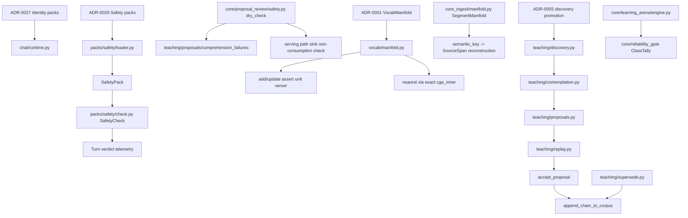

# ADR Corpus Cohesion Dependency Map — 2026-06-30

Status: Phase 1 dependency map for ADR cohesion remediation.

Ground truth:

- Local repository root: `/Users/kaizenpro/Projects/core`
- Local branch / GitHub `main` SHA: `63464144c53f2499b1ea9e5bf3799e80c57a0b53`
- GitHub tree verification used `gh api repos/AssetOverflow/core/contents...` for `/`, `/core`, `/core_ingest`, `/core-rs`, and `/docs/decisions`.
- ADR-0200 exists as `docs/decisions/ADR-0200-expert-claim-reconciliation.md`.
- Baseline lane `make test-fast` is red on current `main`: `54 failed, 10884 passed, 23 skipped, 912 deselected`.

## Map

| ADR Cluster | Primary Surfaces | Additional Surfaces | Tests / Evidence Surfaces | Influence |
|---|---|---|---|---|
| ADR-0027–0029 Safety / Identity | `packs/safety/loader.py`, `packs/safety/check.py` | `core/proposal_review/safety.py`, `chat/pack_resolver.py` | `tests/test_safety_pack.py`, `tests/test_ethics_refusal_opt_in.py`, `tests/test_epistemic_phase3_state_tagging.py`, `tests/test_identity_continuity_proof.py` | Loads immutable safety boundaries, observes runtime safety verdicts, prevents proposal sink serving consumption, keeps pack surface resolution deterministic and non-mutating. |
| ADR-0001 Foundational / Versor | `vocab/manifold.py` | `core_ingest/manifold.py`, `core_ingest/pipeline.py`, `language_packs/en_seeder.py` | `tests/test_vocab_manifold_invariants.py`, `tests/test_engine_loop_proof.py`, `tests/test_determinism_proofs.py`, `core-rs/tests/test_versor.rs` | Enforces unit-versor insertion/update, exact `cga_inner` nearest lookup, and reconstruction-over-storage provenance indexing. |
| ADR-0055–0057 Teaching / Memory / Epistemic | `teaching/review.py`, `teaching/replay.py`, `teaching/proposals.py`, `teaching/promotion.py`, `teaching/supersede.py`, `teaching/contemplation.py`, `teaching/epistemic.py`, `teaching/discovery.py` | `core/proposal_review/*`, `core/learning_arena/*`, `vault/store.py`, `chat/teaching_grounding.py` | `tests/test_learning_loop_demo.py`, `tests/test_teaching_loop_bench.py`, `tests/test_phase_d_replay_evidence.py`, `tests/test_discovery_candidates.py`, `tests/test_mutation_proposal_type.py`, `tests/test_proof_carrying_promotion_demo.py` | Keeps learning proposal-only until review, gates corpus append through replay-equivalence, defaults epistemic state to SPECULATIVE, and keeps practice/reporting separated from serving mutation. |

## Caller / Callee Relationships



## Paste-First Excerpts

### Safety pack loader

`packs/safety/loader.py` defines the fail-closed loader and immutable boundary payload:

```python
class SafetyPackError(RuntimeError):
    """Raised when the safety pack is missing, malformed, or unverified.

    Inherits from ``RuntimeError`` (not ``ValueError`` like
    ``IdentityPackError``) because a missing safety pack is a fail-closed
    runtime condition, not a recoverable input-validation error.
    """
```

```python
def load_safety_pack(
    pack_id: str = DEFAULT_SAFETY_PACK,
    *,
    search_paths: Iterable[Path | str] | None = None,
    require_ratified: bool | None = None,
) -> SafetyPack:
    """Load the safety pack.  Fails closed on any error.
```

### Safety check predicates

`packs/safety/check.py` wires `preserve_versor_closure`, no fabricated sources, no silent correction, no identity override, and no hot-path repair:

```python
_DEFAULT_PREDICATES: dict[str, SafetyPredicate] = {
    "no_fabricated_source": _predicate_no_fabricated_source,
    "no_hot_path_repair": _predicate_no_hot_path_repair,
    "no_identity_override": _predicate_no_identity_override,
    "no_silent_correction": _predicate_no_silent_correction,
    "preserve_versor_closure": _predicate_versor_closure,
}
```

### Proposal sink dry-check

`core/proposal_review/safety.py` verifies that proposal artifacts are inert and unconsumed by serving paths:

```python
def dry_check(
    proposals: list[PendingProposal],
    malformed: list[MalformedArtifact],
    *,
    root: Path | None = None,
    repo_root: Path | None = None,
) -> SafetyVerdict:
    """Verify every artifact is inert and the sink is serving-unconsumed. Returns a SafetyVerdict."""
```

### Pack resolver

`chat/pack_resolver.py` is deterministic, immutable, and reconstruction-over-storage aligned:

```python
def resolve_lemma(
    lemma: str,
    pack_ids: tuple[str, ...] = DEFAULT_RESOLVABLE_PACK_IDS,
) -> tuple[str, tuple[str, ...]] | None:
    """Return ``(pack_id, semantic_domains)`` for the first pack in
    *pack_ids* whose lexicon contains *lemma*, else ``None``.
```

### Vocab manifold

`vocab/manifold.py` enforces the full unit-versor residual on insertion and replacement:

```python
def _assert_manifold_versor(word: str, versor: np.ndarray, *, replacement: bool = False) -> None:
    residual, scalar, residue_norm = _versor_diagnostics(versor)
    if residual > _MANIFOLD_RESIDUAL_TOLERANCE:
        noun = "replacement versor" if replacement else "versor"
```

`nearest()` stays exact:

```python
def nearest(
    self,
    F: np.ndarray,
    exclude_idx: int = -1,
    exclude_indices: set[int] | frozenset[int] | None = None,
    candidate_indices: np.ndarray | list[int] | tuple[int, ...] | None = None,
) -> tuple[str, int]:
    """
    Find the word whose versor is closest to F by CGA inner product.
```

### Ingest reconstruction manifold

`core_ingest/manifold.py` stores provenance spans, not whole documents:

```python
class SegmentManifold:
    """
    Append-only index: semantic_key -> list[ManifoldEntry].
```

```python
def spans_for(self, semantic_key: str) -> list[SourceSpan]:
    """
    Return all SourceSpan records for a given semantic_key,
    flattened across all ManifoldEntry records.
```

### Epistemic status

`teaching/epistemic.py` defaults unknown status to SPECULATIVE:

```python
def parse_status(value: str | None) -> EpistemicStatus:
    """Parse a serialised status string, defaulting to SPECULATIVE.
```

### Teaching review

`teaching/review.py` rejects identity override and keeps accepted examples SPECULATIVE by default:

```python
def review_correction(
    candidate: CorrectionCandidate,
    *,
    identity_score: IdentityScore | None = None,
    identity_manifold: IdentityManifold | None = None,
    epistemic_status: EpistemicStatus = EpistemicStatus.SPECULATIVE,
) -> ReviewedTeachingExample:
```

### Proposal / replay / append path

`teaching/proposals.py` identifies `TeachingChainProposal` as the corpus extension path:

```python
"""ADR-0057 Phase C2 — TeachingChainProposal + append-only proposal log.

A ``TeachingChainProposal`` is the **only** path by which the
system extends its active teaching corpus.
```

The only write primitive is explicit and append-only:

```python
def append_chain_to_corpus(
    chain: dict[str, Any],
    *,
    corpus_path: Path,
    provenance: Provenance,
    chain_id: str | None = None,
    superseded_by: str | None = None,
) -> str:
```

`teaching/replay.py` verifies replay-equivalence without mutating the active corpus:

```python
def run_replay_equivalence(chain: dict[str, Any]) -> ReplayEvidence:
    """Run the gate.  Active corpus bytes byte-identical pre/post.
```

### Discovery and contemplation

`teaching/discovery.py` emits proposal candidates only when the turn is boundary-clean and ungrounded:

```python
def extract_discovery_candidates(
    turn_event: Any,
    intent_tag: IntentTag | None,
    intent_subject_lemma: str | None,
    *,
    grounding_source: str | None = None,
) -> tuple[DiscoveryCandidate, ...]:
```

`teaching/contemplation.py` enriches without mutation:

```python
def contemplate(
    candidate: DiscoveryCandidate,
    *,
    max_depth: int = _DEFAULT_MAX_DEPTH,
    vault_probe: _VaultProbe | None = None,
) -> DiscoveryCandidate:
    """Run the contemplation loop on a single candidate.

    Returns an *enriched* candidate (same id, populated C1 fields).
    Never mutates the corpus, the pack, or the input candidate
```

### Supersession and promotion

`teaching/supersede.py` composes around `append_chain_to_corpus`:

```python
"""ADR-0057 follow-up — operator-driven supersession of an active corpus chain.

Supersession is the **second** mutation surface on the reviewed
teaching corpus (alongside ``teaching.proposals.accept_proposal``).
```

`teaching/promotion.py` creates operator-visible review queues without synthesis:

```python
def promote_gaps(
    gaps: Iterable[Gap],
    *,
    threshold: int = 3,
    include_tainted: bool = False,
) -> tuple[GapPromotion, ...]:
```

### Learning arena

`core/learning_arena/engine.py` runs sealed practice and mutates nothing:

```python
def run_practice(
    problems: Sequence[DomainProblem],
    solver: DomainSolver,
    tether: GoldTether,
    *,
    diagnose: Callable[[str], str] = _default_diagnose,
    tier2_verifier: Tier2Verifier | None = None,
) -> PracticeReport:
```

## Primary vs. Additional Surfaces

- Primary surfaces own enforcement or construction boundaries: `packs/safety/loader.py`, `packs/safety/check.py`, `vocab/manifold.py`, and `teaching/*`.
- Additional surfaces observe, route, or report without becoming alternate authority: `core/proposal_review/*`, `chat/pack_resolver.py`, `core_ingest/manifold.py`, and `core/learning_arena/*`.
- No mapped surface authorizes approximate recall, stochastic fallback, hidden normalization, or unreviewed durable mutation.

