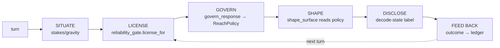

# ADR-0206 — Response Governance Bridge (scaffold)

- **Status:** Accepted (scaffold step) — **cognition-path widening landed 2026-06-06**
  (Step E: the license-gated APPROXIMATE rung). The math-serving seam (§5) remains deferred.
- **Date:** 2026-06-03 (amended 2026-06-06)
- **Supersedes / relates to:** ADR-0175 (calibrated-learning reliability
  gate), the Epistemic-State program (Phase 3, `core/epistemic_state.py`)
- **Scope of THIS PR:** purely additive — design on record + cognition-path
  seam, STRICT-only, no behavior change.

> **2026-06-06 amendment (Step E — cognition-path widening landed).** The `LICENSE`
> node is now **called from serving**: `govern_response` returns `APPROXIMATE_POLICY`
> for a genuine licensed `Action.SERVE` `LicenseDecision` (STRICT for everything else,
> so every existing call site is byte-identical). The first consumer is the converse-guess
> estimator (`generate.determine.estimate`): a refused converse query whose predicate-class
> earned SERVE on the **ratified** reliability ledger
> (`generate/determine/data/estimation_ledger.json`) is served as a **disclosed**
> `[approximate]` estimate via `shape_surface`. wrong=0 is preserved by construction
> (disclosure) + by the gate (θ_SERVE=0.99, earned by volume). **Still deferred:** the
> math-serving seam (`select_self_verified`, §5), `SITUATE` (stakes), and the live
> `FEED BACK` loop — E uses an offline, sealed, hash-verified ledger. Lane:
> `evals.determination_estimation`.

## Context — the consumption gap

CORE has two **built** epistemic substrates:

1. **A ratified decode-state taxonomy** — `core/epistemic_state.py`, a
   `@unique` 15-member `EpistemicState` enum plus an orthogonal
   `NormativeClearance` axis. Every chat turn is *labeled* with its
   decode-state (derived from the grounding source) and the label is
   stamped onto `TurnEvent` / `ChatResponse` and emitted to telemetry.

2. **A deterministic risk-reward gate** — `core/reliability_gate/`
   (ADR-0175). `license_for(class, action, ceilings)` decides whether a
   class has *earned* an action via `measured_reliability / θ_required ≥ 1`.

A source audit (2026-06-03) established the load-bearing fact this ADR
addresses:

> **The decode-state taxonomy is LABEL-ONLY.** No consumer reads a
> decode-state to weigh stakes, modulate response risk, or gate
> approximation/creativity. Every read is a stamp, serialize, badge, or
> filter. The reliability gate is likewise *explicitly not serving-wired*
> (`core/reliability_gate/__init__.py`: "NOT wired into the serving/eval
> path"). The loop that would let these substrates **govern response
> behavior** has zero consumers.

This is the same shape as the ratify-vs-consume gap: the artifacts exist,
the runtime does not read them to act.

## Decision

Introduce the **Response Governance Bridge** — the missing consumer that
reads the two substrates and produces a per-response `ReachPolicy`
governing *how far into uncertainty a response may reach*. This ADR ships
only the **scaffold**: the design on record + a live but inert seam on the
cognition path. The risk-reward widening logic and the math-serving seam
are explicitly deferred (§5).

### §1 — The governing loop (designed; not all built)

| Step | Status |
|------|--------|
| SITUATE (stakes/gravity from intent + domain + decode-state) | **designed** — not built |
| LICENSE (`reliability_gate.license_for`) | **built + called from serving** (Step E, 2026-06-06) |
| GOVERN (`govern_response → ReachPolicy`) | **STRICT, + license-gated APPROXIMATE** (Step E) |
| SHAPE (`shape_surface`, response path reads policy) | **STRICT = identity; APPROXIMATE = disclosed** |
| DISCLOSE (decode-state label) | **built** |
| FEED BACK (outcome → reliability ledger) | **designed** — not built |

Only **GOVERN + SHAPE** ship here. SITUATE and FEED-BACK are named and
deferred to follow-ups.

### §2 — The reach policy

`core/response_governance/policy.py` defines:

- `ReachLevel` — `STRICT < APPROXIMATE < EXTRAPOLATE < CREATIVE`. Only
  `STRICT` is emitted today; the rest name the spectrum the bridge will
  earn entry to via the reliability gate.
- `ReachPolicy(level, admissible_states, rationale, license_ratio)` — the
  inspectable per-response decision (same discipline as
  `reliability_gate.LicenseDecision`).
- `govern_response(*, epistemic_state, license_decision, stakes)` — the
  decision point. **Scaffold: returns `STRICT_POLICY` for every input.**
- `shape_surface(policy, *, committed_surface, decode_state,
  disclosed_alternative)` — the consumer. **At `STRICT` it is the IDENTITY
  transform.** Higher levels surface a *disclosed alternative* for
  non-admissible decode-states — real, policy-sensitive code so the seam is
  live, but unreachable in production because `govern_response` never emits
  them.

### §3 — Why STRICT-only scaffold

The scaffold makes the email's "in active development" claim **true the
moment it lands** while guaranteeing `wrong == 0` is untouched:

- `govern_response → STRICT` is the **single load-bearing return**. The
  cognition response surface now flows through `shape_surface`, but STRICT
  is identity, so the path is **byte-identical** to pre-bridge.
- The seam is **live wiring, not dead code**: `test_seam_is_live_wiring`
  forces `APPROXIMATE` and proves the *same consumer the production path
  calls* yields a different surface. The cognition path's strictness is
  held by exactly the STRICT return — mutate it and the proofs diverge.
- The **math-serving chokepoint (`select_self_verified`) is not touched.**
  It is the single most load-bearing line for `wrong == 0`; after the
  ProofNode lesson (a merge silently killed a guard) it does not get its
  first edit in a scaffold PR. The deferred math seam (§5) carries its own
  widening test.

### §4 — Taxonomy scoping (honestly scoped, not half-dead)

Source-verified split of the 15 `EpistemicState` members (2026-06-03,
including the mapping functions in `epistemic_state.py`): **9 produced, 6
never produced.** (The earlier audit's "7 never produced" over-counted —
its grep excluded `epistemic_state.py`, where the partial→`EVIDENCED_INCOMPLETE`
mapping lives. `EVIDENCED_INCOMPLETE` *is* produced; corrected count is 6.)

| Role | Count | States | Consumed by loop as |
|------|-------|--------|---------------------|
| **ACTIVE** (produced + consumed) | 9 | `DECODED`, `EVIDENCED_INCOMPLETE`, `INFERRED`, `UNVERIFIED_POSSIBLE`, `UNVERIFIED_NOVEL`, `CONTRADICTED`, `AMBIGUOUS`, `UNDETERMINED`, `EPISTEMIC_STATE_NEEDED` | strict-admissible / approximate+ / extrapolate+ / creative / force-refuse / sentinel |
| **RESERVED** (named trigger, not produced) | 5 | `VERIFIED`, `COMPUTATIONALLY_BOUNDED`, `SCOPE_BOUNDARY`, `PERCEIVED`, `DECODED_UNARTICULATED` | each gated on a capability that must land first |
| **RECONCILE** (drift, own PR) | 1 | `EVIDENCED` | declared but never produced; `recognition/outcome.py` owns its own `"evidenced"` |

Reserved triggers:
- `VERIFIED` — needs a canonical-comparison pass (the soundness ≠
  correctness gap); the **only** state that will license widening past gold.
- `COMPUTATIONALLY_BOUNDED` — search-budget exhausted; `generate/derivation/search.py`
  is the near-term emitter.
- `SCOPE_BOUNDARY` — out-of-domain refusal with a reason; needs domain-scope
  detection.
- `PERCEIVED` — raw ingest pre-comprehension; needs a perception lane.
- `DECODED_UNARTICULATED` — decoded but no realizer surface; articulation-gap.

The partition is enforced by `test_taxonomy_partition_is_total_and_disjoint`
(total + pairwise-disjoint over the live enum), so adding an enum member
without scoping it fails the build.

### §5 — Deferred (one kind of change per PR)

- **Math-serving seam** — parameterizing `select_self_verified` with a
  `ReachPolicy` (STRICT branch byte-identical) + the full math-serving
  widening test. Its own PR; smaller blast radius on the wrong==0 organ.
- **`EVIDENCED` reconcile** — map recognition's outcome into
  `EpistemicState.EVIDENCED` at the boundary (or document the two axes). A
  real corrective defect; kept out of this purely-additive scaffold.
- **JSONL emission of `reach_level`** — `reach_level` is carried on
  `TurnEvent` / `ChatResponse` but **not** added to the telemetry audit
  dict here, so every pinned lane SHA stays byte-identical. Emission +
  SHA re-pin is a follow-up (re-pinning a frozen gate is not "additive").
- **SITUATE / FEED-BACK / widening** — the risk-reward logic itself.

## Consequences

- **Honest claim unlocked:** decode-state taxonomy + risk-reward gate =
  *built*; the bridge that lets them govern response reach = *in active
  development* (committed seam, STRICT-only, design on record, widening
  gated behind wrong==0 proofs). Never "live."
- **`wrong == 0` preserved:** STRICT identity + untouched
  `select_self_verified`; serving metric stays `3/47/0`.
- **No frozen gate touched:** telemetry JSONL byte-identical → all pinned
  lane SHAs green.

## Verification

- `tests/test_response_governance.py` — STRICT-only contract, STRICT
  identity, **live-wiring proof (cognition path)**, taxonomy partition.
- Full-surface suite green (doctrine: not smoke).
- `scripts/verify_lane_shas.py` green; `3/47/0` preserved.
