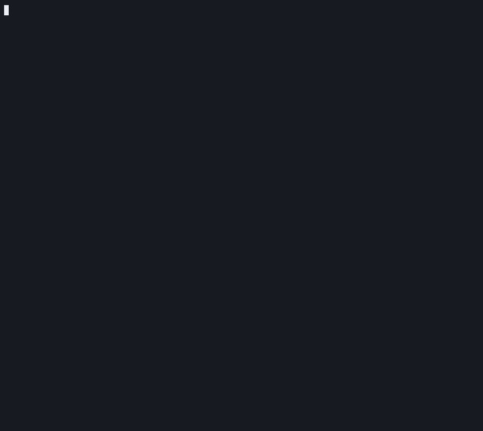

# Anti-Regression Demo — Three-Gate Defense Against Learning Harm

**Date:** 2026-05-18
**Runner:** `evals/anti_regression/run_demo.py`
**CLI:** `core demo anti-regression` (`--json` for machine-readable output)
**Contract tests:** `tests/test_anti_regression_demo.py` (5 passing)
**Reference ADRs:** [0055](../decisions/ADR-0055-inter-session-memory-discovery-promotion.md), [0056](../decisions/ADR-0056-contemplation-loop-c1.md), [0057](../decisions/ADR-0057-teaching-chain-proposal-review.md)



## What this demo shows

When a system extends its own knowledge, **the gate that decides what to
admit is the load-bearing part** — not the proposer.  CORE's reviewed-
corpus extension path has three independent gates that each must pass
before any byte is written to the active teaching corpus.  The demo
runs each gate to verdict against a real `ProposalLog` in an isolated
temp directory and asserts the active corpus is byte-identical pre/post.

| Gate | What it checks | What fails it |
|---|---|---|
| **S1.  Eligibility predicate** (mechanical, pre-replay) | polarity ∈ {affirms, falsifies} ∧ ≥1 `source='corpus'` evidence ∧ claim_domain ≠ evaluative ∧ boundary_clean=True ∧ chain complete | Raises `ProposalError`; **no log row written**. |
| **S2.  Replay-equivalence gate** (mechanical, post-eligibility) | Cognition lane runs against active corpus AND a transient-with-append copy; any strict-decrease in `intent_accuracy / surface_groundedness / term_capture_rate / versor_closure_rate` is regression. | Auto-rejects with **named** regressed metrics in operator_note. |
| **S3.  Operator review** (manual, post-replay) | Replay-equivalence is a *precondition*, not a permission. | `--accept` not run → state stays `pending` indefinitely. |

## Why each gate is independent

A defensive lattice is only useful if each layer can refuse a bad input
on its own — composition can't rescue an inadequate single gate.
Here, each gate has a different *kind* of refusal:

- **S1 is structural** — it checks shape, not behavior. Cheapest to run.
- **S2 is behavioral** — it actually measures what happens if the
  proposal is admitted, on the live cognition lane. The most expensive
  gate and the only one that catches regressions you can't predict
  from shape alone.
- **S3 is intentional** — it requires an operator's explicit decision.
  No bypass; no auto-apply; no scheduled-promote-after-N-hours.

A proposal that fails any one of these never reaches the next.

## Complementary CLOSE flywheel protection (Claim B)

This demo is part of the anti-regression / teaching demonstration surfaces and participates in the **Dedicated CLOSE Flywheel Regression Surface (Claim-B Level)** (see `make test-close-flywheel` and `docs/testing-lanes.md` "Dedicated CLOSE Flywheel Regression Surface...").

As of the post-#791 / #792 work, `core demo anti-regression` (and `tests/test_anti_regression_demo.py`) executes the hardened `evals/close_derived_climb` yardstick. This adds the full Claim-B lived-runtime CLOSE autonomous-growth path (real `idle_tick()` + `IdleTickResult.derived_close_proposals_emitted` gating, explicit `determine(..., rule='direct')` semantic asserts on materialized derived facts, and `content_replay_checksum` over canonical closures + proposal bodies) with its own invariants (wrong_total=0, proposal-only/SPECULATIVE, hermetic, determinism).

As of the review-visibility strengthening, the demo also surfaces structured `proposal_review_summary` (teaching gate review_states + ProposalLog transition counts) and the climb's `proposal_review_posture` (CLOSE-derived proposals' explicit review-gated birth state). See the ratification for scope and invariants.

See:
- `evals/close_derived_climb/contract.md`
- `docs/testing-lanes.md` (Dedicated CLOSE Flywheel Regression Surface section + "Review / Ratification Posture..." subsection + pillar alignment)
- `docs/analysis/close-flywheel-dedicated-regression-surface-ratification-2026-06-16.md`
- `docs/analysis/integrate-hardened-close-yardstick-determinism-teaching-regression-ratification-2026-06-16.md`
- `docs/analysis/close-derived-climb-yardstick-claim-b-ratification-2026-06-16.md`
- `docs/analysis/close-flywheel-proposal-review-visibility-ratification-2026-06-16.md` (this PR)

The three reviewed-teaching gates (S1–S3) and the CLOSE derived-fact growth + review-posture gates are complementary anti-regression surfaces; both must hold. Running the dedicated surface also verifies the integrated embedding.

## The synthetic regression in S2

Scene 2 needs to demonstrate the **rejection lifecycle** deterministically.
The public cognition split's test cases happen to test for subject
lemmas (e.g. "knowledge", "light") that always appear in the
teaching-grounded surface as subjects regardless of an override's
connective or object — meaning engineering a real-world regression that
fires on today's public split takes a controlled corpus.

Rather than ship that complexity, S2 uses the **documented** `run_replay=`
kwarg on `propose_from_candidate` to inject a controlled `ReplayEvidence`
that has the same shape the real gate produces when a real regression
is detected. The operator note, log transition, and corpus-byte-identical
invariant are all real. In production the real gate emits this same
shape; the demo just controls the input so the rejection narrative is
deterministic.

Scenes 1 and 3 both use the real production replay function.

## Sample run

```text
────────────────────────────────────────────────────────────────────────
  S1.  Eligibility predicate refuses ineligible candidates
────────────────────────────────────────────────────────────────────────
  CLAIM: An undetermined-polarity candidate never enters the proposal log.
         ProposalError raised; no log row; no replay invocation.

  candidate.polarity      : undetermined
  outcome                 : ProposalError raised
  error                   : polarity must be 'affirms' or 'falsifies'; got
                            'undetermined' — undetermined candidates cannot
                            propose
  proposal log rows       : 0
  active corpus byte-eq   : True

────────────────────────────────────────────────────────────────────────
  S2.  Replay-equivalence gate auto-rejects a regressing chain
────────────────────────────────────────────────────────────────────────
  CLAIM: An eligible candidate whose append would regress the cognition
         lane is auto-rejected with the named regressed metrics in the
         operator note.  Active corpus byte-identical pre/post.

  proposal_id             : fbd12201819985cb1d3d2f97123c6f0d
  baseline metrics        : {'intent_accuracy': 1.0, 'surface_groundedness':
                             1.0, 'term_capture_rate': 0.9167,
                             'versor_closure_rate': 1.0}
  candidate metrics       : {'intent_accuracy': 1.0, 'surface_groundedness':
                             0.9167, 'term_capture_rate': 0.8334,
                             'versor_closure_rate': 1.0}
  regressed_metrics       : ['surface_groundedness', 'term_capture_rate']
  replay_equivalent       : False
  state                   : rejected
  operator_note           : auto_rollback_regression:
                            surface_groundedness,term_capture_rate
  active corpus byte-eq   : True

────────────────────────────────────────────────────────────────────────
  S3.  Real replay gate runs cognition lane; pass → pending
────────────────────────────────────────────────────────────────────────
  CLAIM: An eligible candidate whose append does not regress reaches
         'pending' state.  Operator --accept is still required to write
         to the active corpus; the gate is a precondition, not a permission.

  proposal_id             : 30585e8e515483c810ad05888e06b572
  baseline metrics        : {'intent_accuracy': 1.0, 'surface_groundedness':
                             1.0, 'term_capture_rate': 0.9167,
                             'versor_closure_rate': 1.0}
  candidate metrics       : {'intent_accuracy': 1.0, 'surface_groundedness':
                             1.0, 'term_capture_rate': 0.9167,
                             'versor_closure_rate': 1.0}
  regressed_metrics       : []
  replay_equivalent       : True
  state                   : pending
  next step               : core teaching review 30585e8e515483c810ad05888e06b572
                            --accept --review-date YYYY-MM-DD
  active corpus byte-eq   : True

════════════════════════════════════════════════════════════════════════
  RESULT
════════════════════════════════════════════════════════════════════════
  all three gates held       : True
  active corpus byte-eq      : True

  Each gate is independent and fails closed.  Bad proposals stop at the
  cheapest applicable gate.  The active corpus is never written to
  anywhere in this demo.
```

## How to reproduce

```bash
core demo anti-regression                  # human output (preamble + scenes + result)
core demo anti-regression --json           # machine-readable DemoReport
python -m pytest tests/test_anti_regression_demo.py -q     # ~60s+ (includes CLOSE yardstick)
```

The demo participates in the Dedicated CLOSE Flywheel Regression Surface (Claim-B Level):
```bash
make test-close-flywheel
```
See `docs/testing-lanes.md` "Dedicated CLOSE Flywheel Regression Surface..." for the full surface definition, Claim-B capabilities, runtime, hermeticity, and pillar alignment.

## Falsifiable claims

If any of these stops holding, the demo's headline no longer holds:

- `report.all_gates_held` is `True`.
- `report.active_corpus_byte_identical` is `True`.
- S1: `outcome="rejected_pre_replay"`, `proposal_id is None`, `replay_evidence is None`.
- S2: `review_state="rejected"`, `replay_evidence.replay_equivalent is False`, and the
  operator note names every regressed metric.
- S3: `review_state="pending"`, `replay_evidence.replay_equivalent is True`,
  `regressed_metrics == []`.

The contract test file pins all of these.

## What CORE has that other systems do not

Continuous pre-training, RLHF, and SFT-pipelines all *can* be regression-
aware, but the regression check is implicit in offline evaluation, not
gated inline at the point of admission. The proposer and the gate are
not separated; rejection is a downstream observability concern, not a
guaranteed-fail-closed structural property. CORE's gate is:

- **Mechanical**, not learned (no policy that can drift).
- **Inline**, not offline (every admission runs the full lane).
- **Named-metric** (any regression is reported with the specific metric
  that regressed, not a single aggregate score).
- **Byte-identical-corpus** (the production state is never partially
  mutated mid-decision).

This is the architecture deployments that care about *what the system
will say tomorrow that it would not have said yesterday* need.

## Related

- Operator command surface: see the [Inter-Session Memory section in README](../../README.md#inter-session-memory--reviewed-learning).
- Learning-loop demo: [`learning_loop_demo.md`](learning_loop_demo.md) — the inverse demo showing the path of a *good* proposal end-to-end.
- Determinism benchmark: [`teaching_loop_bench.md`](teaching_loop_bench.md) — N-run byte-identical-artifact proof.
