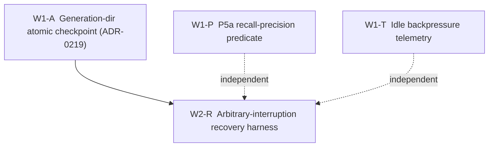

# L10 Continuity Hardening — Brief Pack

**Telos:** CORE is *one continuous life* ([[project-core-is-one-continuous-life]]). A
checkpoint must therefore be a **committed generation**, not a loose set of files.
This pack hardens the L10 resume substrate before the always-on process is built
on top of it: cross-file checkpoint atomicity, arbitrary-interruption recovery,
P5a recall-precision coverage, and idle backpressure telemetry. *Continuous life
cannot rest on mixed-generation state.*

**Scope discipline:** these are continuity-hardening fixes, not new capability.
No serving-path change, no `trace_hash` change, no closure threshold change, no
hot-path repair. Every new predicate ships a `*_holds` **and** a `*_bites`
mutation test (CLAUDE.md schema-as-proof). Each brief opens its own worktree off
`origin/main` ([[feedback-parallel-agent-worktrees]]).

---

## Dispatch DAG



- **Wave 1 (parallel, independent):** W1-A, W1-P, W1-T. No shared files (see
  collision note below).
- **Wave 2 (gated):** W2-R. **HARD GATE — do not dispatch W2-R until W1-A has
  merged to `main`.** The recovery harness must test the *final* checkpoint
  model (generation-dir + `current` pointer), never the known-broken multi-file
  layout. Dispatching it early bakes the old hazard shape into the test.

**Critical path.** W1-A is the critical-path PR: W2-R is hard-gated on it, and
the generation layout it introduces is the reference model that every subsequent
PR must be consistent with. Dispatch W1-A immediately; W1-P and W1-T can run in
parallel alongside it. **No one begins W2-R until W1-A is merged to `main` and
its atomicity tests are green.**

**File-collision note (keeps Wave 1 parallel-safe):**
- W1-A owns `engine_state/__init__.py`, `chat/runtime.py` checkpoint/loader
  paths, and `docs/decisions/ADR-0219-*.md`.
- W1-P owns `evals/l10_continuity/{predicates,runner,report,contract}.py` —
  *additive only* (new predicate + new captured signal; do not touch the
  checkpoint-write path).
- W1-T owns `chat/runtime.py` `idle_tick` + a **new** `core/cognition/`
  telemetry leaf. W1-A and W1-T both touch `chat/runtime.py` but disjoint
  methods (`checkpoint_engine_state`/loader vs `idle_tick`); architectural
  ownership is distinct (W1-A = checkpoint/load atomicity; W1-T = idle
  telemetry observation). Whichever merges second rebases; conflicts are
  trivial.

**Dispatch lines** (operator runs these; do **not** self-dispatch —
[[feedback-no-self-dispatch-of-subagents]]):

```
# Wave 1 — dispatch all three; W1-A is critical path
W1-A [CRITICAL PATH]: docs/handoff/l10-continuity-hardening-briefs-2026-06-15.md  §Brief W1-A
W1-P:                 docs/handoff/l10-continuity-hardening-briefs-2026-06-15.md  §Brief W1-P
W1-T:                 docs/handoff/l10-continuity-hardening-briefs-2026-06-15.md  §Brief W1-T
# Wave 2 — ONLY after W1-A atomicity tests are green on main
W2-R: docs/handoff/l10-continuity-hardening-briefs-2026-06-15.md  §Brief W2-R
```

---

## Brief W1-A — Generation-dir atomic checkpoint (ADR-0219)

```bash
git fetch && git worktree add ../core-l10-atomicity origin/main -b feat/l10-gen-checkpoint
```

**Problem.** A checkpoint is four separately-atomic files (`recognizers.jsonl`,
`discovery_candidates.jsonl`, `session_state.json`, `manifest.json`). ADR-0156
guarantees **per-file** atomicity only — there is **no cross-file atomicity**. A
kill between file writes lands `recognizers@N` over `manifest@N-1`: a
mixed-generation checkpoint. The loader reads each file independently, so it can
compose state across generations. ADR-0156 §"Out of scope" explicitly excludes
both cross-file consistency and parent-dir fsync. A second entry point makes it
worse: `chat/runtime.py:996` `finalize_turn_trace_hash` re-saves
`discovery_candidates.jsonl` *outside* the checkpoint sequence.

**Decision (ADR-0219, extends ADR-0156).** The checkpoint becomes a committed
**generation directory**; commit is the atomic replacement of a single `current`
pointer:

```
engine_state/
  gen-0041/
    recognizers.jsonl
    discovery_candidates.jsonl
    session_state.json
    manifest.json
  current          # one line: "gen-0041"; written via os.replace
```

Write the full next generation into `gen-<N+1>/`, fsync each file, **fsync the
generation directory**, then `os.replace` a temp `current` into place, then fsync
the parent dir. Reader resolves `current` → loads exactly that generation;
in-progress `gen-*` dirs without a pointer entry are garbage, ignored.

**Files.**
- `engine_state/__init__.py` — `EngineStateStore`: generation resolution
  (`_current_generation()`), `begin_generation()`/`commit_generation()` (the
  pointer swap), `_atomic_write_text` reused per-file inside the gen dir, parent-
  and gen-dir fsync. Keep `load_*` reading from the resolved gen dir.
- `chat/runtime.py` — `checkpoint_engine_state` writes one generation then swaps
  the pointer **once** (the manifest is no longer the commit marker; the pointer
  is). `finalize_turn_trace_hash` must **not** re-save into a committed
  generation — fold its candidate re-stamp into the next checkpoint, or write a
  fresh generation. The loader (`__init__` ~line 718, `_load_*` ~790–846)
  resolves via `current`.
- `evals/l10_continuity/runner.py` — `_inject_orphan_tmp` and
  `read_recovered_turn_count` updated to the new layout (orphan = a half-written
  `gen-*` dir / temp `current`).
- `docs/decisions/ADR-0219-generation-checkpoint-atomicity.md` — the ADR. Grep
  ADR-0146/0156/0157/0158 first ([[feedback-adr-cross-reference-discipline]]).

**Legacy.** A pre-0219 flat `engine_state/` (manifest.json at root) must
**migrate explicitly** on first load (wrap the flat files into `gen-0000/`,
write `current`) **or** be read-only fallback. Never silently mix the two.

**Acceptance gate (verbatim, all must hold):**
- crash before pointer swap restores prior generation;
- crash after pointer swap restores new generation;
- incomplete gen dirs are ignored;
- no load path mixes files across generations;
- legacy `engine_state` layout either migrates explicitly or is read-only fallback;
- no normalization/repair on restore;
- `versor_condition` remains `< 1e-6`.

**GC.** Retain last K generations (K≥2 so an in-flight write never strands the
committed one); prune older committed gens after a successful swap. Log what was
pruned ([[feedback-no-silent-caps]]).

**Validation.** New `tests/test_adr_0219_generation_checkpoint.py` (one test per
gate bullet, each mutation-biting). `core test --suite smoke -q`, `--suite
runtime -q`, then `PYTHONPATH=. .venv/bin/python -m evals.l10_continuity 12 3`
(P1–P4 stay green). Update `docs/runtime_contracts.md` if the on-disk layout is
named there.

**Forbidden.** Any restore-time `unitize`/grade-projection/drift repair; changing
payload bytes inside a file (only the *layout* changes); weakening the versor
ceiling; leaving `finalize_turn_trace_hash` as a second un-generationed writer.

---

## Brief W1-P — P5a recall-precision predicate

```bash
git fetch && git worktree add ../core-l10-p5a origin/main -b feat/l10-p5a-recall
```

**Problem.** P5a (`recall precision@k stability`) is the one L10 leg recorded
`not_covered` (`evals/l10_continuity/report.py:45`, `contract.md:36`). The
T-experience claim — a continuous lived memory — is unproven without it.

**Decision.** Add `evaluate_p5a_recall_precision` to
`evals/l10_continuity/predicates.py`, a pure function over soak evidence, plus a
held-out probe capture in `runner.py`. Metric is **rank-based**, not
score-threshold — the contract already notes "the raw recall score is not a clean
similarity". Vault recall (`vault/store.py:224`) ranks by **exact CGA inner
product** and pins exact-query matches to rank-1 via `_exact_index`. So: seed a
small probe set of known-relevant entries early in the soak, interleave
distractor turns, then at the end (and **after a reboot leg**) re-probe and assert
each relevant entry returns within top-k. `precision@k` = fraction of probes whose
relevant entry is in the top-k. Falsifiable: a recall regression or a
persistence-round-trip rank shift trips it.

**Precision wrinkle to surface in the predicate doc + test (don't paper over).**
Vault recall casts the query to **float32** (`vault/store.py:250`) while Shape B+
persistence is **bit-exact float64** (`core/array_codec.py`). A reboot that
round-trips float64 then recalls at float32 *could* shift a near-tie rank. The
predicate must explicitly probe **across a reboot** so this is measured, not
assumed away. If ranks are stable, that is the evidence; if they shift, that is a
real finding for a follow-up (do not "fix" it by changing recall to float64 —
that is a separate, ratified decision).

**Files.** `predicates.py` (+`evaluate_p5a_recall_precision`), `runner.py`
(capture probe recalls into `TurnRecord` or a sidecar probe result — additive
fields, NaN/empty when undefined), `report.py` (move P5a out of `NOT_COVERED`
into the predicate panel; update `deterministic_digest` payload accordingly),
`contract.md` (move the P5a row from "Not covered" into the table with its
threshold basis).

**Validation.** `test_p5a_recall_precision_holds` (real soak) **and**
`test_p5a_recall_precision_bites` (a mutated/evicted relevant entry trips it).
`PYTHONPATH=. .venv/bin/python -m evals.l10_continuity`. The digest will change —
re-pin it and note the flip in the PR.

**Forbidden.** Cosine/approximate similarity anywhere (CLAUDE.md exact-recall
invariant); a score-threshold metric; touching the checkpoint-write path (that is
W1-A); declaring P5a covered without a biting mutation test.

---

## Brief W1-T — Idle backpressure telemetry

```bash
git fetch && git worktree add ../core-l10-backpressure origin/main -b feat/l10-backpressure-telemetry
```

**Problem.** `idle_tick` drains pending discovery candidates into reviewable
proposals. ADR-0161 already provides a hard **cap** (256 pending, `queue_full`
report — `docs/hitl-backpressure.md`) — that is a *control* mechanism. What is
missing is **telemetry**: an observational signal of backlog depth, inflow vs
drain, and proximity to the cap, so pressure is *visible before* the cap starts
refusing. Do **not** add a new control mechanism; reuse ADR-0161's cap.

**Decision.** Add an observational telemetry leaf modeled exactly on
`core/cognition/leeway.py` ([[milestone... B4 leeway]] precedent — frozen
dataclass, content-addressed digest, **zero serving-path mutation, byte-identical
`trace_hash`**). New `core/cognition/backpressure.py`:
`BackpressureRecord(pending_proposals, candidate_backlog, cap, headroom,
contemplated_this_tick, created_this_tick, at_fixed_point, did_work)` +
`build_backpressure_record(...)`. `idle_tick` (`chat/runtime.py:857`) already
computes every input (`contemplated_count`, `created`, `_count_pending_proposals()`,
the `_pending_candidates` length, `did_work`); the cap comes from
`CORE_HITL_PENDING_CAP`/256. Attach the record to `IdleTickResult` and persist it
in the engine-state dir (W1-A's generation) so backpressure history survives
reboot. Surface is observational only — no gating, no refusal logic here.

**Files.** `core/cognition/backpressure.py` (new), `chat/runtime.py`
(`idle_tick` builds + attaches the record; `IdleTickResult` gains the field —
additive), a small persistence hook (append-only telemetry line, or a field in
session_state — coordinate with W1-A's layout; if W1-A hasn't merged, write to a
flat `idle_telemetry.jsonl` and note the follow-up to fold into the generation).

**Validation.** `tests/test_idle_backpressure_telemetry.py`: record fields match
the tick's actual counts; **`trace_hash` of a served turn is byte-identical with
and without telemetry enabled** (the firewall proof — the load-bearing test);
backlog-growing vs draining ticks produce the expected `headroom`/`at_fixed_point`.
`core test --suite teaching -q`, `--suite smoke -q`.

**Forbidden.** Any change to the served surface or `trace_hash`; a new
backpressure *cap* (ADR-0161 owns that); coupling the telemetry leaf to a serving
import (read decisions duck-typed like leeway does); blocking/refusing in
`idle_tick` on telemetry.

---

## Brief W2-R — Arbitrary-interruption recovery harness  ⟂ GATED on W1-A merged

```bash
# ONLY after W1-A (feat/l10-gen-checkpoint) is on main:
git fetch && git worktree add ../core-l10-recovery origin/main -b feat/l10-recovery-harness
```

**Problem.** Today P4 proves recovery only from a *clean* checkpoint plus an
ignored orphan temp, with the reboot injected at a **turn boundary**. It does not
prove recovery from a kill at an **arbitrary point inside the checkpoint write**.
With W1-A's generation model that hazard is *structurally* closed; this brief
proves it empirically against the final model.

**Decision.** Extend `evals/l10_continuity/runner.py` to inject a kill at each
checkpoint sub-step — after `gen-<N>/` partially written, after fully written but
**before** the `current` swap, and after the swap — and reconstruct. Add
predicate(s) in `predicates.py` asserting the gate bullets empirically:
recovery before-swap → prior generation; after-swap → new generation; an
incomplete `gen-*` dir is ignored; the recovered `turn_count` matches the
committed generation's; two independent recoveries from the same committed
pointer converge (extend the existing P4 `recovery_determinism` /
`commit_point`); `versor_condition < 1e-6` throughout.

**Files.** `runner.py` (sub-step kill injection — a small enum of cut-points
threaded through `run_soak`), `predicates.py` (`evaluate_p4_arbitrary_interruption`
or extend P4 — each cut-point a `*_holds`/`*_bites` pair), `report.py`/`contract.md`
(name the new coverage; update the digest).

**Validation.** Per cut-point `*_holds` + `*_bites`. Full panel:
`PYTHONPATH=. .venv/bin/python -m evals.l10_continuity 12 3`. Confirm the panel
exercises the generation layout (a torn `gen-*` dir, not a flat-file orphan).

**Forbidden.** Testing the pre-0219 flat layout; any repair-on-restore; relaxing
the commit-boundary check; landing before W1-A is on `main`.

---

## Cross-cutting acceptance (every PR)

- Lookback review before any Wave 1 PR merges and again before W2-R, per
  [[feedback-lookback-review-discipline]] (this is a 4-PR sequence on the L10
  continuity surface).
- `core test --suite smoke -q` green; the relevant dedicated suite green; the
  L10 lane green and its `deterministic_digest` re-pinned where a predicate set
  changed (W1-P, W2-R).
- PR checklist (CLAUDE.md): capability/boundary added; invariant proving the
  field stays valid (`versor_condition < 1e-6`); CLI/eval lane proving it; no
  hidden normalization / stochastic fallback / approximate recall / unreviewed
  mutation; trust boundary stated (W1-A touches files + crash recovery).
- Merge then clean up branch **and** worktree immediately
  ([[feedback-merge-then-cleanup-always]]).
