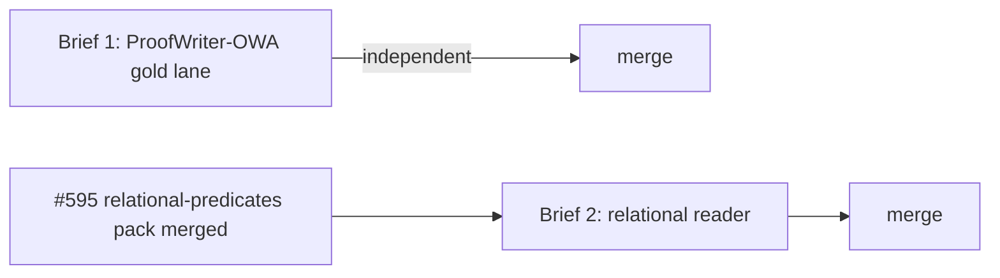

# Brief pack — DETERMINE independent gold + relational reader (2026-06-06)

Two parallel-safe briefs extending the comprehend→realize→determine spine.

## DAG



- **Brief 1** depends on nothing new (uses the `member` predicate already in the reader). Dispatch now.
- **Brief 2** depends on **#595 merged** (it consumes that pack's lemmas).
- Files are disjoint (`evals/proofwriter_owa/` vs `generate/meaning_graph/` + relation realize/determine) → the two can run concurrently once #595 lands.

---

## Brief 1 — ProofWriter-OWA gold lane (independent oracle for DETERMINE's refusal floor)

**Open with:**
```bash
git fetch origin main
git worktree add ../core-pw-owa origin/main -b feat/proofwriter-owa-gold-lane
```

**Why.** DETERMINE asserts `answer=True` only on direct entailment of a non-negated `member` relation, else `Undetermined`, and never asserts False (open-world). ProofWriter's **OWA split** has a genuine `Unknown` label — the only dataset label semantics that match open-world soundness. An item DETERMINE asserts that gold marks `Unknown`/`False` is a **wrong=0 breach**. This lane makes that breach *findable* against an independent symbolic oracle (INV-25 fit). It is **measure-only: no engine code, no reader tuning.**

**Scope (do exactly this, nothing more):**
1. **Curate a SMALL OWA fixture** — a few dozen items, NOT the corpus (CLAUDE.md: no bulk-ingest). Select **only** items expressible as DETERMINE input: a set of `X is a Y` / type-attribute facts + a single `Is X a Y?`-shaped query, gold ∈ {True, Unknown}. Deterministic selection (sort by ProofWriter id, fixed slice). Commit as `fixtures.jsonl` + a pinned SHA.
2. **Provenance** (`provenance.md`): cite source (AllenAI ProofWriter V2020.12.3, arXiv:2012.13048) and record the deterministic selection rule so the fixture is reproducible. Attribution only — no relicensing/redistribution handling; this is a dev gold fixture in a public repo.
3. **Scorer** (`score.py`): for each item run `comprehend` → `realize` each fact → `determine(query)`; tally `{correct: asserted-True ∧ gold-True, refused: Undetermined, wrong: asserted ∧ contradicts gold}`.
4. **Test** (`test_proofwriter_owa_lane.py`): assert **`wrong == 0`**; pin the fixture SHA; print coverage (`correct / total`).

**Expected result — state it up front so it isn't read as failure:** DETERMINE has no rule engine, so depth≥1 Trues will **refuse** (coverage miss, NOT wrong). High refusal + **wrong=0** is the pass. The lane's job is to prove no curated OWA item can make DETERMINE assert an `Unknown`.

**Do NOT:** tune the reader to ProofWriter templates (overfitting trap — coverage is measured, not chased), assert False, add any inference/rule step, or import `generate.derivation`/`core.reliability_gate` (keep it off the GSM8K serving path).

**Files:** `evals/proofwriter_owa/{fixtures.jsonl, provenance.md, score.py}`, `tests/test_proofwriter_owa_lane.py`. **Tool budget:** ~12–18 calls. Verify with the new test + `core test --suite smoke -q`.

---

## Brief 2 — relational reader (first consumer of `en_core_relational_predicates_v1`)

**Precondition:** #595 merged to main. **Open with:**
```bash
git fetch origin main
git worktree add ../core-rel-reader origin/main -b feat/relational-reader
```

**Why.** #595 added the predicate lexemes (`parent_of`, `less_than`, `left_of`, `before_event`, …) but they are **inert — zero consumers.** This brief builds the deterministic reader that maps NL binary-relation statements onto those predicates, realizes them, and lets DETERMINE answer direct relational queries — the substrate CLUTRR (kinship) and FOLIO/ProofWriter (order/spatial/temporal) need before they can be scored at all.

**Scope:**
1. **Relational comprehension** (extend `generate/meaning_graph/reader.py` or a sibling module): recognize binary-predicate templates (`A is the parent of B`, `A is less than B`, `A is left of B`, `event A is before event B`) → `Relation(predicate=<pack lemma>, arguments=(A,B), negated=False)`. **Fail-closed:** emit a predicate ONLY when both the template and a mounted pack lemma match; otherwise refuse (no guessing, no field vote). Entities may be OOV (the #591/#593 substrate handles arbitrary names).
2. **Pack access without default-mount:** load `en_core_relational_predicates_v1` explicitly for the reader; do **not** flip `gate_engaged` / default-mount (that's a separate ratification). Resolve lemmas from the loaded pack.
3. **Realize + DETERMINE for relations:** extend the realize path to store realized binary-relation facts (reuse `_realize_structured`; new `structure_kind`), and extend `determine` to answer a non-negated binary-relation query by **direct entailment only** — mirror the `member` path exactly: assert `answer=True, basis="as_told"` on a direct hit, else `Undetermined`. **No transitive/symmetric/rule inference** (later slice); never assert False.

**wrong=0 obligation (must bite):** a test that introduces one violation — reader emitting a predicate on a non-matching template, or DETERMINE asserting a relation never realized — and confirms an existing test FAILS. Schema-defined-proof-obligation discipline: no vacuous tests.

**Do NOT:** add transitive/symmetric closure, negation handling, or any predicate not in the mounted pack; mutate identity/runtime; touch the GSM8K serving path; default-mount the pack.

**Files:** relational reader module + tests under `generate/meaning_graph/`, relation extensions in `generate/realize/` + `generate/determine/`, dedicated tests. **Tool budget:** ~25–35 calls. Verify with new tests + `core test --suite smoke -q` + `core test --suite cognition -q`.

---

### Sequencing note
Brief 1 falsifies the refusal floor on an independent oracle (no new capability). Brief 2 turns #595 from terminology into a parser and is the prerequisite for kinship/order/spatial/temporal datasets. **DETERMINE-deepening** (entailed-negation → assert-False, unlocking FOLIO's two-sided labels and ProofWriter CWA) is a *third* brief, gated behind Brief 2.
