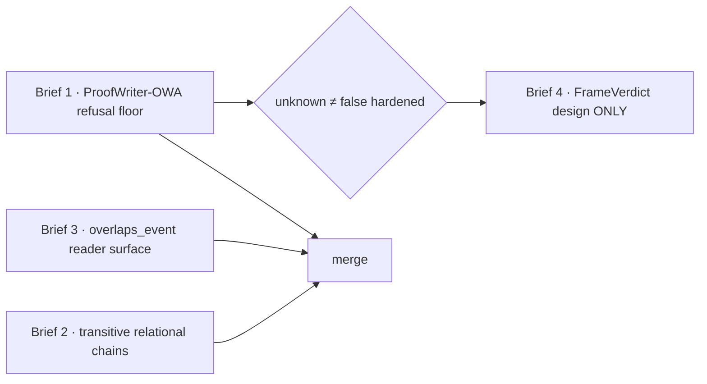

# Brief pack — Step-3 relational reasoning (2026-06-15)

**Status:** READY TO DISPATCH. **Base:** `main @ 6f70e834` (#775 merged).
**Telos:** [[project-core-is-one-continuous-life]] — grow `comprehend → determine`
with *lawful entailment over grounded facts*, open-world refusal preserved, INV-30's
no-`False` firewall intact. **Not template spam.**

## Where we are (substrate these briefs build on)

The mastery-v2 Step-3 lead landed: **one-hop sound relational entailment** (#775) —
`determine()` now answers inverse/converse + pack-declared symmetric queries
(`_relational_one_hop`, `Determined.rule`), open-world (True-or-refuse), measured on
the capability index (**breadth 10**, `wrong_total` 0). The firewall (#770, INV-30:
`determine()` constructs only `Determined(answer=True)`) and the typed-learning
boundary doctrine are on `main`. Relational *breadth* (16 predicates) and one-hop
*inference* are done; what remains is **deeper sound entailment**, a **refusal floor**,
a **reader-surface gap**, and the **two-sided design**.

## DAG (sequence + integration)



- **B1 first** (safety): hardens the open-world refusal floor that B2 and later
  closed-world work would otherwise stress. Measure-only — lowest risk.
- **B2, B3 are parallel-development safe, not conflict-free.** They may be built in
  separate worktrees, but both can touch `generate/meaning_graph/relational.py`,
  `evals/relational_inference/v1/`, and capability-index baseline artifacts. Dispatch
  concurrently only with the expectation that one branch rebases after the other lands;
  the second merger owns the final baseline re-freeze.
- **B4 is DESIGN ONLY**, gated: do not implement until B1 is landed *and* the design
  is ratified. Drafting it in parallel is fine.

## Shared acceptance gates (every capability brief — B2/B3)

```text
□ reader template + mounted-pack-lemma requirement (if a reader change)
□ positive fixtures AND negative/confuser fixtures
□ independent oracle/ruler — disjoint from the solver (INV-25 / INV-27)
□ capability-index contribution: breadth/coverage RISES (re-freeze baseline)
□ replay digest stable (deterministic; no clock/LLM/sampling)
□ wrong_total == 0 (the hard gate)
□ INV-30 stays green; if determine.py's Determined() site count changes, update
  test_determine_construction_sites_are_visible (currently 3, all answer=True)
□ NOT template spam — lawful structure under refusal discipline, not more recognizers
```

B1 is **measure-only** (no engine change) and is a **wrong=0 refusal gate, NOT a
capability-index domain** (a refusal floor has low coverage and would drag
`coverage_geomean`). B4 is **design only**.

---

## Brief 1 — ProofWriter-OWA refusal-floor lane *(lead; dispatch first)*

**Open with:** `git fetch origin main && git worktree add ../core-pw-owa origin/main -b feat/proofwriter-owa-gold-lane`

**Why.** `determine()` asserts `answer=True` only on entailment, never `False`, never
from absence (open-world). ProofWriter's **OWA split** has a genuine `Unknown` label —
the dataset semantics matching open-world soundness. An item `determine()` asserts
that gold marks `Unknown` is a **wrong=0 breach**. This lane makes that breach
*findable* against an independent symbolic oracle, hardening "unknown ≠ false" **before**
transitive chains (B2) and closed-world work (B4) can stress it. (This is the never-landed
Brief 1 from `docs/handoff/proofwriter-owa-and-relational-reader-briefs-2026-06-06.md`.)

**Scope (exactly this).**
1. Curate a **SMALL** OWA fixture — a few dozen items, NOT the corpus (no bulk-ingest).
   Only items expressible as DETERMINE input: a set of `X is a Y` / binary-relation facts
   + one yes/no query, gold ∈ {True, Unknown}. Deterministic selection (sort by ProofWriter
   id, fixed slice). Commit `fixtures.jsonl` + a pinned SHA.
2. `provenance.md`: cite AllenAI ProofWriter V2020.12.3 (arXiv:2012.13048) + the
   deterministic selection rule (reproducible). Attribution only.
3. `score.py`: per item `comprehend` → `realize` each fact → `determine(query)`; tally
   `{correct: asserted-True ∧ gold-True, refused: Undetermined, wrong: asserted ∧
   contradicts gold}`.
4. `tests/test_proofwriter_owa_lane.py`: assert **`wrong == 0`**, pin the fixture SHA,
   print coverage. This is a standalone gate — do **not** add it to the capability index.

**Expected (state up front, not failure).** DETERMINE has limited inference, so depth≥1
Trues will **refuse** (coverage miss, NOT wrong). High refusal + **wrong=0** is the pass.

**Do NOT:** tune the reader to ProofWriter templates (overfitting), assert False, add any
inference step, or import `generate.derivation` / `core.reliability_gate`.

**Files:** `evals/proofwriter_owa/{fixtures.jsonl, provenance.md, score.py}`,
`tests/test_proofwriter_owa_lane.py`. **Budget:** ~12–18 tool calls.
**Verify:** the new test + `core test --suite smoke -q` (use `python -m pytest` in the worktree).

---

## Brief 2 — Transitive relational chains *(parallel-development safe; sequential integration)*

**Open with:** `git fetch origin main && git worktree add ../core-rel-trans origin/main -b feat/relational-transitive`

**Why.** #775 added one-hop. Some relational predicates are **transitive strict orders**:
`a < b ∧ b < c ⊨ a < c`. Today that refuses (one hop only). Extend **sound positive
entailment beyond one hop** for the genuinely-transitive predicates — the next sound
reasoning increment, not template spam.

**Scope.**
1. Declare a CLOSED `_TRANSITIVE_PREDICATES` table in `generate/meaning_graph/relational.py`
   — **strict orders ONLY**: `less_than`, `greater_than`, `before_event`, `after_event`.
   A predicate is transitive **only if explicitly declared** (default off).
2. Extend `determine()` with a transitive relational step that **REUSES the existing
   search-then-verify pattern** — reachability over the predicate's realized edges, then
   `proof_chain` ROBDD verification (mirror `_determine_subsumption`; do NOT hand-roll a
   second prover). Open-world (True only), `Determined.rule="transitive"`. Prefer routing
   through the shared `_relational_determined` constructor so the INV-30 site count stays 3.
3. Independent transitive-closure oracle (BFS reachability over the edges), authored
   disjoint from `determine.py`. New `evals/relational_transitive/v1/` lane +
   `capability_index` adapter; re-freeze baseline (breadth 10→11).

**wrong=0 bite (must bite).** Non-transitive predicates MUST refuse the chain: `sibling_of`
is not transitive; `parent_of` is not transitive (`parent∘parent = grandparent ≠ parent`);
spatial `left_of`/`right_of` are **not** admitted here because they require an explicit
shared-frame/total-order proof that this slice does not have. A confuser lane proves each
of these refuses; a `Determined` on any is a breach.

**Do NOT:** declare any non-strict-order predicate transitive; build a new inference engine
(reuse the ROBDD); assert False; touch the GSM8K serving path.

**Files:** `relational.py` (`_TRANSITIVE_PREDICATES`), `determine.py` (transitive step),
`evals/relational_transitive/v1/{cases.jsonl,refusals.jsonl,provenance.md}`, a runner, the
adapter, baseline re-freeze, a lane test + unit tests. **Budget:** ~30–40 tool calls.
**Verify:** new tests + `test_architectural_invariants.py::TestINV30...` + `core test --suite cognition -q`.

---

## Brief 3 — `overlaps_event` finite-verb reader surface *(parallel-development safe; sequential integration)*

**Open with:** `git fetch origin main && git worktree add ../core-rel-finite origin/main -b feat/relational-finite-verb-surface`

**Why.** The relational reader requires `<A> is <connective> <B>` (copula adjacent to the
connective). Finite-verb connectives don't take a copula — `The meeting overlaps the lunch`
refuses (`no_relational_template`) and `is overlaps` is ungrammatical. So `overlaps_event`
(pack-declared symmetric) is unreadable — the **known coverage gap** flagged in #775's
`evals/relational_inference/v1/provenance.md`. Close it.

**Scope.**
1. Extend `comprehend_relational` to ALSO accept a **finite-verb surface** `<A> <verb> <B>`
   (no copula) for a CLOSED finite-verb connective set. This brief should add `overlaps`
   only; future finite verbs require their own closed table entries and mounted pack lemmas.
   **Fail-closed:** emit only when the verb maps to a mounted pack lemma AND both argument
   slots are free of connective/reserved tokens; otherwise refuse. Reuse the existing
   argument-slot guard (the `_CONNECTIVE_TOKENS` fabrication net) — extend it to the new form.
2. `overlaps_event` then reads → add it to `evals/relational/v1/cases.jsonl` (reader gold)
   and the symmetric case to `evals/relational_inference/v1/cases.jsonl`; re-freeze baseline.

**wrong=0 bite.** The finite-verb form must NOT over-read: `Alice overlaps with the team
and Bob` (leftover structure) must refuse, not fabricate a compound entity. A refusal
fixture proves it.

**Do NOT:** accept any finite verb not in the closed table or absent from the pack; relax
the argument-slot guard; add inference (this is reader-surface only); touch serving.

**Files:** `relational.py` (finite-verb table + surface handling), `evals/relational/v1/`
+ `evals/relational_inference/v1/` gold (+overlaps), baseline re-freeze, reader tests +
refusal fixtures. **Budget:** ~25–35 tool calls. **Verify:** `test_relational_reader.py`,
`test_relational_inference_lane.py`, `test_capability_baseline.py`, `core test --suite cognition -q`.

---

## Brief 4 — FrameVerdict / two-sided closed-world *(DESIGN ONLY — gated)*

**Open with:** `git fetch origin main && git worktree add ../core-frameverdict origin/main -b docs/frameverdict-design`

**Why.** `determine()` is open-world (True-or-refuse; INV-30 forbids `False`). ProofWriter-CWA
and FOLIO carry two-sided labels (entailed-`False`); perception (ADR-0211 `ObservationFrame`
falsification, `SUPPORTED|FALSIFIED`) is closed-world-within-a-frame. The **frame-general
closed-world verdict** is their convergence point. Design it before any impl so closed-world
falsehood can never contaminate the open-world runtime.

**Scope — a DESIGN doc / ADR, NO runtime code.** Specify:
```text
FrameVerdict:
  frame_kind:        text | perception | audio | ...
  world_assumption:  open | closed | bounded_closed
  verdict:           entailed_true | entailed_false | undetermined | contradiction | scope_boundary
  basis / proof / evidence
```
- A **distinct type and entry point** from the open-world `Determined` — the runtime
  `determine()` path NEVER produces a `FrameVerdict`; closed-world verdicts are lane-scoped.
- How a **closed-world context** is established (an explicit closed-world frame; never the
  default session memory, where absence ≠ false).
- How `entailed_false` is **sound** (entailed negation under an explicit CWA).
- The **convergence** with ADR-0211 (`SUPPORTED|FALSIFIED` → `FrameVerdict`), per
  [[project-spine-modality-neutral-convergence]].
- A proposed **new invariant**: closed-world `False` cannot reach the open-world runtime
  (the analogue of INV-30, one level up).

**Gate (per the sequencing call).** Do NOT implement until (a) **Brief 1 is landed** (the
refusal floor is hardened) AND (b) this design is reviewed/ratified. The doc may be drafted
now; code waits.

**Do NOT:** add any `answer=False` path to `determine.py`; wire a runtime caller; weaken INV-30.

**Files:** `docs/decisions/ADR-XXXX-frame-verdict-closed-world.md` (+ an optional non-wired
schema stub). **Budget:** ~15–25 tool calls (mostly reading ADR-0211 + `determine.py` + INV-30
to ground the design).

---

### Dispatch summary

| # | Brief | Kind | Integration | Risk |
|---|-------|------|-------------|------|
| 1 | ProofWriter-OWA refusal floor | measure-only | first | low |
| 2 | Transitive relational chains | capability | develop parallel; integrate sequentially | medium (scope to strict orders) |
| 3 | `overlaps_event` finite-verb surface | reader | develop parallel; integrate sequentially | low–medium |
| 4 | FrameVerdict closed-world | design only | after 1 lands | n/a (no code) |

Each operator runs `python -m pytest` **in its own worktree** (the `core` script resolves to
the main checkout — see [[feedback-env-core-rs-build-and-public-demo-flake]]). Merge order:
land **B1** before B4 impl; land B2/B3 in either order, with the second merger rebasing and
owning the final baseline re-freeze.