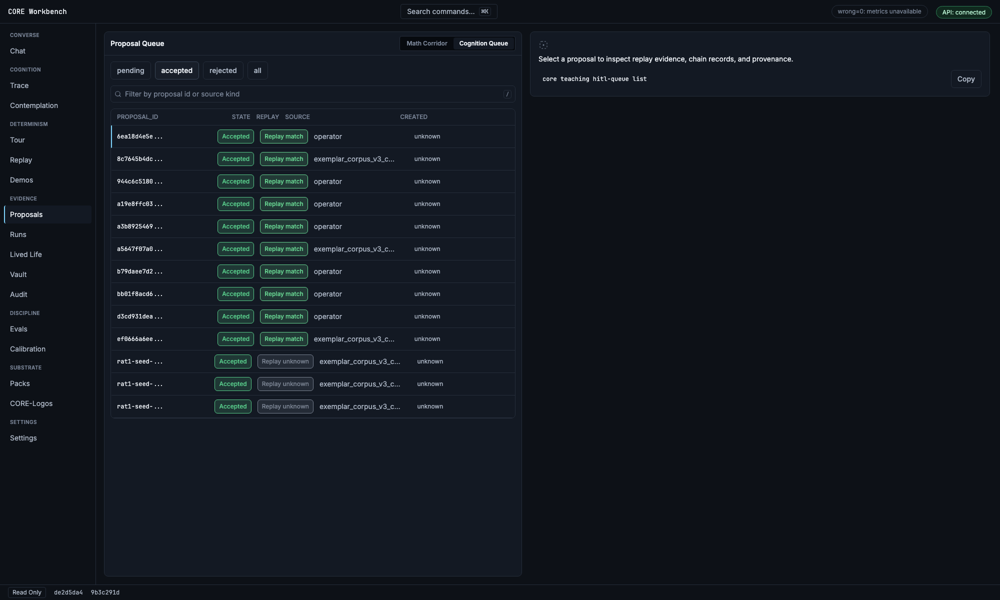
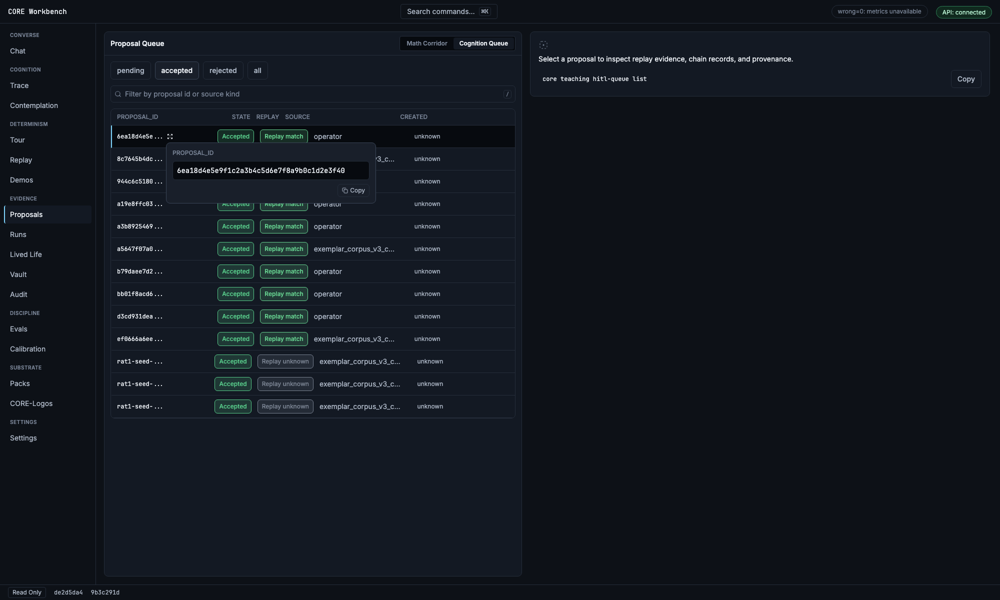
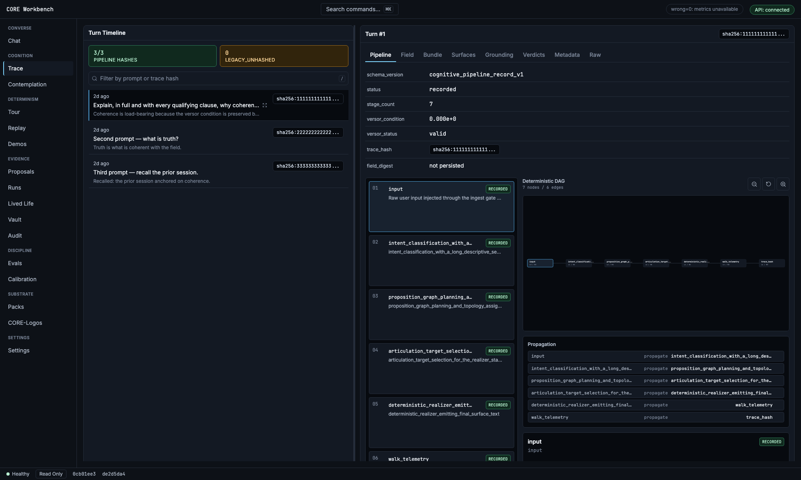
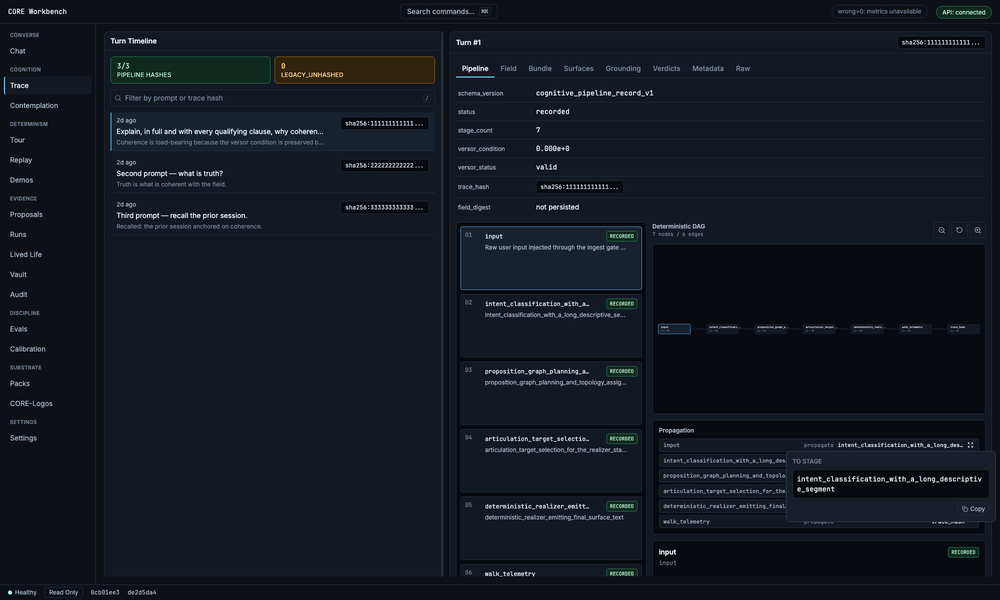
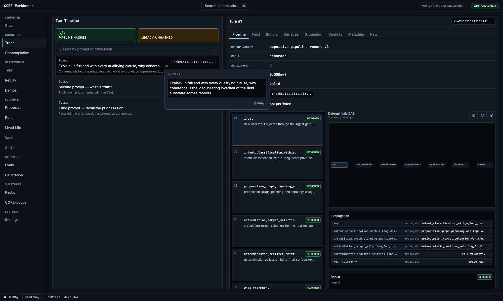

# Workbench `TruncatedCell` — visual evidence (2026-06-14)

Visual confirmation that the full-content reveal for truncated table cells
(PRs **#749** and **#750**) behaves correctly in the real built workbench UI.

These shots were captured by driving the production `vite preview` build with
Playwright, mocking the workbench API (`{ ok: true, data }` envelope) with data
shaped to mirror real responses — long opaque ids, `exemplar_corpus…` sources,
long pipeline stage names, and long prompt excerpts — so the truncation +
reveal affordance actually triggers. No code changed; this is verification only.

## What `TruncatedCell` provides

Every truncated data cell keeps its compact display but attaches one
hover/focus-revealed trigger that opens an accessible popover with the **full
value** (selectable) plus **one-click copy**; long/structured values also offer
"Open full view" into a modal. The reveal trigger calls `stopPropagation`, so it
never selects the surrounding row.

Coverage:

- **#749** — columnar tables: proposal queue, eval wrong=0 case ledger,
  CORE-Logos contents, proposal artifacts.
- **#750** — trace propagation edges + every single-column selection rail
  (trace stage/turns, runs, replay, packs, logos, contemplation, demos) and
  proposal detail/chain hashes.

## Proposal queue (the originally reported table)

Cognition Queue, accepted filter — truncated `proposal_id` and
`exemplar_corpus…` source cells, mirroring the reported screenshot.

Clicking a cell's reveal icon opens the popover with the **full** `proposal_id`
(`6ea18d4e5e9f1c2a3b4c5d6e7f8a9b0c1d2e3f40`) and a Copy button. The row stays
unselected (right panel still shows the placeholder) — `stopPropagation` holds.

## Trace route — edges + selection rails (#750)

Full Trace view: the truncated **Turn Timeline rail** (left), the **stage rail**
with long stage names (middle), and the **Propagation edges** table (right).

Reveal on a propagation **edge** — the right-aligned `to_stage` cell
(`align="end"`) opens a popover with the full long stage name + copy.

Reveal on the **selection rail** — a Turn Timeline row's prompt opens a popover
with the full multi-line prompt text + copy, without selecting the row.

## Verification notes

- Built from `origin/main` after #749 + #750 merged.
- Popovers reported `data-state: open`; rail/edge reveals left the row
  unselected (`aria-current` count 0) — matches the `stopPropagation` unit test.
- The reveal trigger is a 16×16 icon button (`button[aria-label^="Show full"]`),
  distinct from the row's own click target.
- One harness gotcha worth recording: `getByRole("button", { name: /show full …/ })`
  resolves to the **row** (its computed accessible name absorbs the child
  trigger's `aria-label`), not the icon — target the trigger by attribute
  (`button[aria-label="Show full …"]`) when driving these cells in tests.
