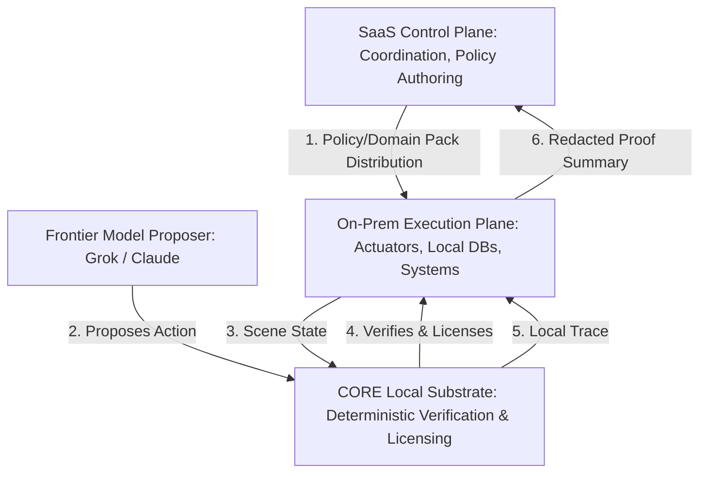

# SaaS / On-Premise Authority Boundary Memo
**Date: 2026-06-11**

---

This memo outlines the architectural separation between cloud-based coordination and local execution authority within CORE. 

---

## 1. Core Framing
For high-consequence and regulated industries—including aerospace, defense, automotive, and factory automation—delegating execution authority to an external cloud control plane is an unacceptable risk. Network latency, connectivity loss, and cloud security breaches can jeopardize physical safety and operational integrity.

CORE addresses this through a simple framing:

> **The cloud may coordinate. The local execution plane decides.**

We position CORE around two core principles:
*   **"CORE is on-prem authoritative and SaaS-compatible."**
*   **"CORE’s execution authority should live where the customer’s risk lives."**

---

## 2. Architectural Components

### The SaaS Control Plane
The SaaS plane is restricted to coordination, monitoring, and telemetry collection. It operates as a coordination plane, distributing policy guidelines and domain semantic packs, but it has no direct execution privileges on-prem. It cannot issue licenses or bypass local security gates.

### The Local / On-Prem Execution Plane
The local execution plane is where physical and digital operations are carried out. It consists of the local database, network infrastructure, robotic control wrappers, and the CORE local substrate. Because CORE runs locally, execution decisions are made in real-time, independent of external internet connectivity.

### Policy & Domain-Pack Distribution
Organizations author policies centrally in the SaaS interface, compile them into compact, immutable semantic packs, and sign them cryptographically. These packs are distributed to local nodes. Once deployed, the local nodes enforce policies deterministically, ensuring that local executions cannot be altered dynamically by an unverified cloud payload.

### Local Traces and Redacted Proof Summaries
Every state transition evaluated by local CORE instances generates a byte-identical trace hash. 
To preserve privacy and prevent the leakage of proprietary operational data (e.g., flight telemetry, factory sensor values, proprietary code):
1.  **Detailed traces remain local.** The complete step-by-step state data is stored securely on the customer's on-prem hardware.
2.  **Redacted proof summaries are sent to the SaaS plane.** A summary containing only the outcome status (e.g., `authorized`, `refused`), the policy ID, and the cryptographic trace hash is sent to the cloud for compliance and reporting.

---

## 3. Why Customer-Local Authority Matters
For organizations like Tesla, SpaceX, or SpaceXAI [VERIFY BEFORE OUTREACH], operational data is highly proprietary and subject to strict security classifications. 
*   **No Data Surrender:** CORE does not require customers to upload raw operational sensor data, camera feeds, or internal source code to a centralized cloud.
*   **High Availability:** If a Starlink terminal or internet connection drops, the local factory or spacecraft system must continue to enforce safety gates. A cloud-first authority model would brick operations during outages.
*   **Clear Compliance Boundaries:** Regulated entities can prove compliance to external auditors by demonstrating that their safety policies are enforced locally by an immutable, deterministic engine, with trace hashes verifying that no tampering occurred.
