# Audio Compiler Spec — `audio_core_v1`

**Companion to:** [ADR-0181](../decisions/ADR-0181-audio-compiler-delta-crdt.md)
**Status:** Proposed (PR-1 docs)
**Scope:** the deterministic substrate (PR-2/PR-3) and its Delta-CRDT delta interface (PR-5).

This spec fixes the typed intermediate representation, the operator/manifest format, the numeric
determinism rules, and the `AudioCompilationUnit` → Delta-CRDT delta contract. It is
implementation-facing; the *why* lives in ADR-0181, the *acceptance* lives in the eval plan.

---

## 1. Two-clock architecture

A low-level **acoustic clock** measures signal facts; a higher-level **auditory grammar clock**
emits typed events. The primary path is fully deterministic; learned systems are confined to
auxiliary evidence lanes (PR-6).

```mermaid
flowchart LR
  A[Waveform bytes / live stream] --> B[Canonicalizer<br/>mono + fixed SR + checksums]
  B --> C[Frame grid<br/>20 ms window / 10 ms hop]
  C --> D[Acoustic lexer<br/>energy, voicing, onset,<br/>pitch candidates, spectral bands, pauses]
  D --> E[Typed AudioIR parser<br/>speech/pause spans, prosody arcs,<br/>turn/overlap events, non-speech atoms, anchors]
  E --> F[Canonical ordering<br/>quantization + stable serialization]
  F --> G[Operator registry<br/>pack manifest + blade aliases + theta rules]
  G --> H[Rotor lowering]
  H --> I[Versor composition<br/>unitize_versor + versor_condition]
  I --> J["(32,) float32 — one AudioCompilationUnit"]
  E --> K[Audio evidence trace<br/>hashes, teacher provenance, pack IDs]
  J --> L[Thread-local arena<br/>ADR-0180 §2.1]
  L --> M[Semilattice merge<br/>keyed by content-addressed sha]
```



## 2. Typed AudioIR

The IR is built from **typed spans and events**, never from raw frames or mel bins. Transcript
anchors may exist only as auxiliary content hypotheses, never as the sole meaning of the audio.

```python
from __future__ import annotations
from dataclasses import dataclass
from typing import Literal
import numpy as np


@dataclass(frozen=True, slots=True)
class AudioSignal:
    samples: np.ndarray        # canonical mono float32
    sample_rate: int           # 24_000
    start_ms: int
    end_ms: int
    source_sha256: str
    canonical_sha256: str


@dataclass(frozen=True, slots=True)
class PitchCandidate:
    cents_q: int               # quantized cents
    prob_q: int                # 0..255


@dataclass(frozen=True, slots=True)
class AudioToken:
    kind: Literal[
        "silence", "voiced", "unvoiced", "onset",
        "energy_bin", "pitch_candidates", "spectral_bin",
    ]
    start_hop: int
    end_hop: int
    value_q: tuple[int, ...]   # canonical quantized payload


@dataclass(frozen=True, slots=True)
class AuditoryEvent:
    event_type: str
    start_hop: int
    end_hop: int
    attrs: tuple[tuple[str, int | str], ...]
    evidence_ids: tuple[str, ...]


@dataclass(frozen=True, slots=True)
class AudioIR:
    speech_spans:     tuple[AuditoryEvent, ...]
    pause_spans:      tuple[AuditoryEvent, ...]
    prosody_arcs:     tuple[AuditoryEvent, ...]
    turn_events:      tuple[AuditoryEvent, ...]
    non_speech_events: tuple[AuditoryEvent, ...]
    content_anchors:  tuple[AuditoryEvent, ...]
    ir_sha256:        str
```

### 2.1 The compilation unit (the CRDT delta)

```python
@dataclass(frozen=True, slots=True)
class AudioCompilationUnit:
    canonical_sha256:  str
    ir_sha256:         str
    pack_id:           str
    pack_manifest_sha256: str
    projection_sha256: str
    versor:            np.ndarray   # (32,) float32
    versor_condition:  float

    @property
    def merge_key(self) -> tuple[str, str, str]:
        # ADR-0181 §2.2 — content-addressed CRDT merge / dedup key.
        return (self.canonical_sha256, self.ir_sha256, self.projection_sha256)
```

`AudioCompilationUnit` is the single object the audio adapter writes into its thread-local arena
(ADR-0180 §2.1). It carries no PCM (ADR-0181 §3.1 / ADR-0180 §1.5.5).

## 3. Canonical signal formation

- Internal processing: **mono, 24 kHz, float**; original-source bytes preserved separately for
  provenance; a derived 16 kHz stream is produced **only** for teacher ASR (PR-6).
- Resampling: **pinned polyphase FIR** (SciPy `resample_poly` semantics — zero-phase,
  odd-length symmetric filter). The FIR coefficients are generated **once**, stored as a pack
  artifact (`resample_fir_v1.npy`), and checksummed in the manifest. The runtime never relies on
  library defaults.

## 4. Acoustic lexer

Operates on **measured facts**, not semantic guesses. Default frame 20 ms / hop 10 ms. Each
frame yields quantized descriptors: RMS/log-energy bin, voiced/unvoiced flag, candidate F0 set
(pYIN-style: multiple candidates with probabilities **before** Viterbi smoothing), onset
strength bin, coarse spectral centroid/tilt bin, zero-crossing regime, pause classification.

## 5. Parser → typed events

Promotes lexer output into typed spans/events. Preserves the distinction between "No.", "No?",
shouted "No!", whispered "no", and silent hesitation. Non-speech atoms (laughter, alarm, impact,
music, broadband noise) are first-class; "chaotic noise" is the fallback only when a more
specific parse is impossible.

## 6. Operator registry (pack-local blade aliases)

Because the `(32,)` boundary is fixed but no canonical *semantic* blade map is exposed, v1 uses
**pack-local, versioned, checksummed blade aliases**. v1 uses **elliptic bivector operators
only** (square = −1), so every rotor uses the numerically well-behaved
`R = cos(θ/2) + B·sin(θ/2)`. Hyperbolic/boost-like operators are deferred.

| Auditory atom family | Measured source | Alias | Default blade index | Theta rule |
|---|---|---|---|---|
| Speech present | voiced frames / harmonic ratio | `B_SPEECH` | 6 | `q(base + g1·voiced_ratio_q)` |
| Short pause | pause duration | `B_PAUSE_SHORT` | 7 | `q(base + g2·dur_hops)` |
| Long pause | pause duration | `B_PAUSE_LONG` | 8 | `q(base + g3·dur_hops)` |
| Rising final contour | final F0 slope | `B_PITCH_RISE` | 9 | `q(base + g4·slope_q)` |
| Falling final contour | final F0 slope | `B_PITCH_FALL` | 10 | `q(base + g5·abs(slope_q))` |
| Emphasis / force | energy delta | `B_EMPHASIS` | 11 | `q(base + g6·delta_db_q)` |
| Hesitation / uncertainty | filled pause + low-conf contour | `B_HESITATION` | 12 | `q(base + g7·hesitation_q)` |
| Turn boundary | silent gap + local reset | `B_TURN` | 13 | `q(base + g8·boundary_q)` |
| Overlap / interruption | simultaneous speech / abrupt cut | `B_OVERLAP` | 14 | `q(base + g9·overlap_q)` |
| Alert-like event | salience / alarm morphology | `B_ALERT` | 15 | `q(base + g10·salience_q)` |
| Laughter | periodic burst pattern | `B_LAUGH` | 16 | `q(base + g11·laugh_q)` |
| Cry / distress | voicing + modulation profile | `B_DISTRESS` | 17 | `q(base + g12·distress_q)` |
| Music / tonal bed | stable harmonic bed | `B_MUSIC` | 18 | `q(base + g13·tonal_q)` |
| Chaotic broadband noise | flat/noisy spectrum | `B_NOISE` | 19 | `q(base + g14·noise_q)` |

Indices are **reasonable defaults, not metaphysical claims** about Cl(4,1). The contract is that
the mapping is explicit, versioned, checksummed, and frozen in the manifest. `B_OVERLAP` and
`B_TURN` are the atoms that motivate per-stream arenas in ADR-0181 §2.3.

### 6.1 Minimal manifest (`packs/audio/audio_core_v1/manifest.toml`)

```toml
pack_id = "audio_core_v1"
modality = "audio"
cl41_dim = 32
compiler_version = "0.1.0"
basis_version = "audio-basis-v1"

[canonical]
sample_rate = 24000
channels = 1
frame_ms = 20
hop_ms = 10
output_dtype = "float32"
internal_dtype = "float64"

[resampling]
algorithm = "polyphase_fir"
fir_path = "resample_fir_v1.npy"
fir_sha256 = "sha256:REPLACE_ME"
padtype = "constant"
cval = 0.0

[gating]
gate_engaged = false
checksum_verified = false
versor_condition_max = 1.0e-6

[ordering]
event_precedence = ["channel", "pause", "speech", "prosody", "turn", "non_speech", "content_anchor"]
```

### 6.2 Operator row (`operators.jsonl`)

```json
{
  "operator_id": "audio.prosody.question_contour.v1",
  "event_type": "prosody.question_contour",
  "blade_alias": "B_PITCH_RISE",
  "blade_index": 9,
  "rotor_kind": "elliptic",
  "base_theta_q": 64,
  "gain_rules": {"slope_q": 3, "final_energy_q": 1, "confidence_q": 1},
  "theta_clip_q": 384,
  "version": "1"
}
```

## 7. Numeric determinism

Rule: **quantize before semantics, normalize after composition.** Raw float measurements are too
unstable to hash. Quantization regime (frozen in manifest): boundaries in hop units, log energy
in 1 dB bins, F0 in 25-cent bins, pitch slope in coarse cents-per-100 ms bins, spectral shape in
fixed ordinal bins, all confidences in uint8. After quantization, compute in float64, compose
sparse rotors in canonical order, call algebra-owned `unitize_versor`, cast to float32 **only**
at the output boundary.

```python
import math
import numpy as np

EPS = 1e-12

def quantize_theta(theta: float, step: float = 1.0 / 1024.0) -> float:
    return round(theta / step) * step

def build_elliptic_rotor(blade_index: int, theta: float) -> np.ndarray:
    out = np.zeros(32, dtype=np.float64)
    half = quantize_theta(theta) / 2.0
    out[0] = math.cos(half)
    out[blade_index] = math.sin(half)
    return out

def compile_events(events, registry, geometric_product, unitize_versor, versor_condition):
    # SERIALIZATION BARRIER (ADR-0181 §2.1): in-chunk composition is order-sensitive,
    # single-threaded, canonical order. The substrate never parallelizes this loop.
    v = np.zeros(32, dtype=np.float64)
    v[0] = 1.0
    for ev in events:                          # must already be in canonical order
        spec = registry[ev.event_type]
        theta = spec.theta_from_event(ev)      # deterministic, quantized inputs only
        r = build_elliptic_rotor(spec.blade_index, theta)
        v = geometric_product(v, r)
        v = unitize_versor(v)
    if versor_condition(v) >= 1e-6:
        raise ValueError("audio compilation failed versor check")
    return v.astype(np.float32)
```

`geometric_product`, `unitize_versor`, `versor_condition` are imported from `algebra/` — the
audio compiler adds **no** new normalization function.

## 8. Repo-facing adapter (`sensorium/adapters/audio.py`)

```python
from __future__ import annotations
from dataclasses import dataclass
import numpy as np

@dataclass(frozen=True, slots=True)
class AudioProjectionHead:
    compiler: "AudioCompiler"
    modality = ...                # Modality.AUDIO

    @property
    def embedding_dim(self) -> int:
        return 32

    def project(self, signal: "AudioSignal") -> np.ndarray:
        unit = self.compiler.compile(signal)
        out = unit.versor
        if out.shape != (32,):
            raise ValueError(f"expected (32,), got {out.shape}")
        if out.dtype != np.float32:
            raise TypeError(f"expected float32, got {out.dtype}")
        return out

    def project_batch(self, signals: list["AudioSignal"]) -> np.ndarray:
        return np.stack([self.project(s) for s in signals], axis=0)

    def verify_unitarity(self, signal: "AudioSignal") -> bool:
        return self.compiler.compile(signal).versor_condition < 1e-6
```

The adapter is thin and pack-governed; it satisfies the `ProjectionHead` protocol in
`sensorium/protocol.py` and is mounted as a `ModalityPack(modality_type=Modality.AUDIO,
gate_engaged=False)` until the eval gates pass.

## 9. Delta-CRDT delta interface (PR-5)

The audio adapter **never** writes the global `epistemic_state` (ADR-0180 §2.1). Instead:

1. `compile()` produces one `AudioCompilationUnit` per canonical chunk (the serialization
   barrier of §7 runs here).
2. The unit is written lock-free into the adapter's **thread-local arena**. Concurrent streams
   (overlap/interruption) each have their own arena (ADR-0181 §2.3).
3. The **Merge Kernel** (ADR-0180 §2.2, an explicitly-mounted component, not a daemon — ADR-0180
   §1.5.5) folds pending units into the global Vault ordered by `unit.merge_key`. Duplicate keys
   are deduplicated (idempotence).
4. The kernel surfaces its pending-delta count in `TurnEvent` for replay evidence (ADR-0180
   §1.5.5).

The per-chunk Vault contribution is `(versor, provenance)` where provenance =
`{merge_key, pack_id, pack_manifest_sha256}` — content-addressed, no PCM.

## 10. File plan (PR-2 … PR-6)

```text
sensorium/audio/{__init__,types,canonical,checksum,resample,frames,lexer,parser,operators,compiler,trace,fixtures,teachers}.py
sensorium/adapters/audio.py
packs/audio/audio_core_v1/{manifest.toml,basis_map.json,operators.jsonl,atoms.jsonl,prototypes.jsonl,resample_fir_v1.npy,checksums.json}
tests/test_audio_{signal,resample,lexer,parser,compiler,pack_manifest,sensorium_mount,trace,crdt_delta}.py
evals/audio_sensorium/{fixtures/*.wav,manifest.json,expected_ir.jsonl,expected_projection_hashes.json}
```
