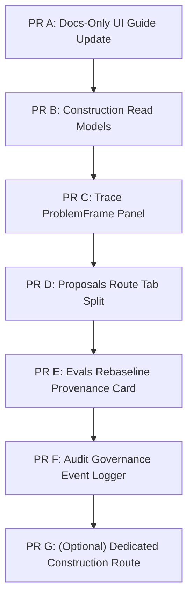

# Workbench/UI Alignment Scope Note: Proposal-First Construction & Governance

**Status:** Approved & Registered Scope Note  
**Date:** 2026-06-20  
**Author:** Gemini 3.5 Flash (docs-only Workbench scope auditor)  
**Governing Doctrine:** ADR-0223, ADR-0224, and the PR #841-#849 reconciliation baseline  

---

## 1. Current Workbench Baseline

The CORE Workbench is established as a **local operator/auditor surface**, not a mutation console. Every visual claim displayed on the UI must trace to a backend read model, committed artifact, or allowlisted execution path.

### 1.1 Route Registry & Shortcuts
The single source of truth for all routes is `workbench-ui/src/app/routes.ts`. There are currently **16 registered routes** grouped into 7 wayfinding sections:

| Section | Route | Path | Shortcut | Purpose |
|---|---|---|---|---|
| **Converse** | Chat | `/chat` | `⌘1` | Execute a normal CORE turn and journal evidence. |
| **Cognition** | Trace | `/trace` | `⌘2` | Inspect turn surfaces, grounding, stage rail, propagation, and trace hashes. |
| **Cognition** | Contemplation | `/contemplation` | Palette | Inspect persisted contemplation process traces. |
| **Determinism** | Tour | `/tour` | Palette | Guided determinism tour over the real demos with honesty cards. |
| **Determinism** | Replay | `/replay` | `⌘3` | Re-run a turn in a sealed fresh runtime and compare envelopes. |
| **Determinism** | Demos | `/demos` | Palette | Run registered determinism demos. |
| **Evidence** | Proposals | `/proposals` | `⌘4` | Review the teaching proposal queue and HITL ratification. |
| **Evidence** | Runs | `/runs` | `⌘6` | Browse recorded session runs, identity continuity, and checkpoint gaps. |
| **Evidence** | Lived Life | `/lived-life` | Palette | Watch always-on heartbeat loop closure (`versor_condition < 1e-6`) evidence. |
| **Evidence** | Vault | `/vault` | `⌘8` | Inspect persisted vault entries with exact CGA recall evidence. |
| **Evidence** | Audit | `/audit` | `⌘9` | Read deterministic audit events (digests, mutation boundary flags). |
| **Discipline** | Evals | `/evals` | `⌘5` | Run/read allowlisted eval lanes and wrong=0 ledgers. |
| **Discipline** | Calibration | `/calibration` | Palette | See gold-tether arena practice classes and license verdicts. |
| **Substrate** | Packs | `/packs` | `⌘7` | Browse language/identity pack manifests, checksums, and metadata. |
| **Substrate** | CORE-Logos | `/logos` | Palette | Inspect CORE-Logos pack overview, lexicon, glosses, morphology, alignment, and safety. |
| **Settings** | Settings | `/settings` | `⌘0` | Manage local UI preferences; engine config remains CLI-only. |

### 1.2 EvidenceSubject Grammar
The RightInspector and Evidence Chain Rail render details dynamically based on a canonical `EvidenceSubject` structure:
- `turn` -> `/trace/<turnId>`
- `proposal` -> `/proposals/<proposalId>`
- `eval_result` -> `/evals/<laneId>`
- `artifact` -> `/replay/<artifactId>`
- `run` -> `/runs/<sessionId>`
- `pack` -> `/packs/<packId>`
- `vault_entry` -> `/vault?inspect=vault:<entryIndex>`
- `audit_event` -> `/audit?inspect=audit:<eventId>`
- `calibration_class` -> `/calibration?inspect=calibration:<className>`

### 1.3 Baseline Absences from UI-UX-GUIDE
- **Leeway Evidence:** Full B4 leeway annotations are not admitted; only B4a nullable `LeewayEvidence` read models are exposed.
- **CORE-Logos Studio:** Only the read-only `/logos` viewer is supported. No patch-forge, draft-state editing, or pack-mutation UI is authorized.
- **Universal Proposal Envelope:** Designed conceptually, but the UI lacks a unified artifact display template.

---

## 2. Architecture Pivots Since Latest Workbench Guide

Several critical back-end pivots have landed since the last UI-UX Guide update (Wave M B3.5). The UI must align with these boundaries:

### 2.1 The Proposal-First Construction Seam (ADR-0223 / ADR-0224)
The back-end math and quantitative reasoning pipelines have transitioned to a strict one-way authority gradient:
```text
surface/process cue
→ ConstructionProposal(status="proposed")
→ exact mention/entity/quantity bindings
→ ContractAssessment
→ diagnostic runnable/refused
```
- **Closeness Proposes:** Surface text matching or process-frame triggers authorize the creation of a `ConstructionProposal(status="proposed")`. This proposal is a pure *hypothesis* and is created *before* role binding or validation.
- **Bindings Ground:** Spans from the text are bound to roles (e.g. `base_quantity`, `scale`, `state_entity`).
- **Contracts Determine:** The organ-specific `ContractAssessment` evaluates these bindings and decides if the contract is `runnable` or `refused` (with typed blocker codes). 
- **Diagnostic Posture:** All proposal-first families (such as `proportional_change.decrease_to_fraction` and `partition.percent_partition`) enforce `diagnostic_only=True` and `serving_allowed=False`. The UI must never display these constructions as runnable in serving or active in response generation.

### 2.2 Quantity-Entity Upcoming Seam
The authorized foundational slice `binding.quantity_entity` introduces local quantity-to-entity grounding:
- Quantities are bound to entities (`MentionBinding(binding_type="quantity_entity")`) and optionally to units (`MentionBinding(binding_type="quantity_unit")`).
- Spans must match the source text exactly.
- The UI must render these relations as diagnostic grounding facts in the frame, rather than generic entity extractions or semantic ontology mappings.

### 2.3 Governed Report Rebaseline Discipline (#847 / #848)
- Ephemeral live runner outputs (e.g., train accuracy shifts from `6/44/0` to `30/20/0` after a capability change) must not be committed casually within capability PRs.
- The committed `report.json` is a **sealed, governed artifact**.
- Any modification to `report.json` must occur in a dedicated rebaseline PR, explicitly authorized by a governance/rebaseline role, to preserve the sacred `wrong_ids == []` invariant.

### 2.4 Fresh-Base Agent Startup Guard (#849)
- `scripts/agent_startup.sh` enforces workspace hygiene before any agent edits.
- It prevents stale worktrees from causing conflict-prone PRs by validating HEAD alignment with `origin/main` (or requiring explicit ancestral alignment override via `CODEX_ALLOW_NON_MAIN_BASE=1` for PR-resumption).

---

## 3. UI Gaps

The current Workbench UI contains several conceptual and routing gaps relative to the backend pivots:

1. **Proposals Route Collision:** The `/proposals` route reads primarily like a Human-In-The-Loop (HITL) teaching/memory proposal queue. It needs to distinguish:
   - **Teaching Proposals:** Persisted corrections in the teaching loop awaiting review.
   - **Construction Proposals:** Ephemeral/diagnostic structural hypotheses extracted from a turn's `ProblemFrame` (with `status="proposed"`, `"partial"`, `"closed"`, or `"refused"`).
   - **Contract Assessments:** The runnable/refused evaluations that prove or refuse a construction proposal.
2. **Trace Route Deficit:** The `/trace` detail view lacks visual support for `ProblemFrame` constructions. It needs a dedicated **Construction** or **ProblemFrame** panel displaying the entire pipeline:
   `proposals` → `evidence spans` → `mention bindings` → `contract assessments` → `dispatch status/blockers`.
3. **Evals Route Ambiguity:** The `/evals` view shows live runs and wrong counts but does not differentiate:
   - Committed/ratified report pins (stable in git).
   - Ephemeral live runner outputs (which may show capability lifts not yet committed to report pins).
   - Unratified artifact mutations and historical rebaseline events.
4. **Audit Route Gaps:** The `/audit` log should display artifact and rebaseline governance events (e.g., when a report pin is ratified, or when an unauthorized file modification is blocked) as distinct, flagged events.
5. **Read-Only Enforcements:** The CORE-Logos and Packs routes must remain read-only; no "Studio" or "mutation" affordances can be simulated.
6. **Registry / Command Palette Parity:** The command palette must not advertise route shortcuts or commands for un-shipped pages. No route registry paths or command counts may change until the underlying page and read models are implemented.
7. **Evidence Chain Rail Grammar:** If the backend exposes them, the Evidence Chain Rail needs address mappings for construction proposals and assessments (e.g., `/proposals/construction:<familyId>` or `/trace/<turnId>?inspect=assessment:<organName>`).

---

## 4. Recommended UI Update Sequence

To address these gaps safely, future UI PRs should follow a sequential, decoupled path:



### A. Docs-Only Workbench Doctrine Update
- **Scope:** Align `docs/workbench/UI-UX-GUIDE.md` with proposal-first semantics, clarifying that proposals are hypotheses and contracts are the runnable authority.
- **Constraint:** No code changes.

### B. Read-Model Inventory for Construction Proposals and Assessments
- **Scope:** Add backend API read-model endpoints to expose `ProblemFrame.proposals` and `assess_contracts()` results for a given turn ID.
- **Constraint:** Read-only endpoints; no execution paths.

### C. Trace ProblemFrame/Construction Read-Only Panel
- **Scope:** Add a sub-tab in `/trace` to visualize the grounded mentions, bindings, and active construction proposals for the selected turn. Highlight exact text spans on hover and display contract refusal blocker codes clearly.

### D. Proposals Route Tab Split / Filter Split
- **Scope:** Introduce clear UI tabs or filters in `/proposals` to separate "Teaching & Memory Proposals" (which require HITL operator ratification) from "Diagnostic Construction Proposals" (which are immutable, turn-scoped hypotheses).

### E. Evals Rebaseline Provenance Card
- **Scope:** Add a metadata card to `/evals` that displays the current committed report pin status vs. live output, referencing the controlling rebaseline session document and ratification PR hash.

### F. Audit Route Artifact-Governance Reader
- **Scope:** Integrate governance events (such as rebaselines, startup guard outcomes, and reconciliation audits) into the `/audit` stream.

### G. Dedicated Construction Route (Only under Evidence Pressure)
- **Scope:** If diagnostic families grow beyond the capacity of the Trace panel, introduce a dedicated `/constructions` route showing global catalog families, role obligations, and test-suite adequacy.
- **Constraint:** Do not add this route early; route counts and shortcuts must remain locked at 16 until evidence demands it.

---

## 5. Non-Goals

The following patterns violate CORE architecture and are explicitly forbidden from future UI work:
- **No Mutation UI:** The UI must never allow editing, adding, or deleting files, packs, or database records.
- **No Applying Proposals:** The UI cannot provide button triggers to apply or run a construction proposal.
- **No Generic Entity Extraction:** Do not build arbitrary NLP extraction views or taggers. Only display the exact bindings generated by the backend `ProblemFrame`.
- **No Serving Admission Controls:** The UI must not provide toggle switches to promote diagnostic families to serving or modify the `serving_allowed` state.
- **No Hidden Normalization:** The UI must display raw, un-repaired values. It must never normalize floating-point values or massage `versor_condition` readouts.
- **No CORE-Logos Studio:** The `/logos` route is a viewer; no interactive "Studio" features (pack editing, patch-forge creation) may be implemented.

---

## 6. Acceptance Criteria for Future UI Work

Every future UI contribution must satisfy:
1. **Evidence-Driven Only:** The UI must only render committed, backend-provided JSON payloads. No mock data or UI-synthesized states.
2. **Honest Empty States:** If a turn has no construction proposals, show "No construction proposals in this frame" rather than implying the pipeline failed.
3. **Exact Span Mapping:** Spans shown in the UI must map exactly to character offsets in the raw problem text.
4. **Diagnostic Integrity:** Visual elements for diagnostic-only families must carry clear "Diagnostic Only / Serving Disallowed" tags.
5. **Honest Evals:** If `wrong_ids` is non-empty, the count of wrong answers must be highlighted in red; do not hide errors behind generic success badges.
6. **Registry Conformance:** Any new route must be registered in `WORKBENCH_ROUTES` and satisfy route conformance (loading, error, and empty state handles).

---

## 7. Recommended Next Implementation Briefs

For the next sessions, the following PR briefs are recommended:

### Brief 1: Align UI Guide with Proposal-First Doctrine
```text
PR Title: docs(workbench): align UI guide with proposal-first construction doctrine

Task:
- Update docs/workbench/UI-UX-GUIDE.md to document the proposal-first construction seam.
- Define the separate roles of ConstructionProposal (status="proposed", diagnostic) and ContractAssessment (runnable authority).
- Document the governance rules for evals rebaselines and the startup guard.

Constraints:
- No changes to workbench-ui/*, generate/*, or tests/*.
- Docs-only alignment pass.
```

### Brief 2: Read ProblemFrame Construction Evidence in Trace
```text
PR Title: feat(workbench): read ProblemFrame construction evidence in Trace

Task:
- Expose initial_frame.proposals and ContractAssessment results in the turn read model API.
- In the Trace route UI, add a "Construction" tab next to the "Pipeline" and "Field" tabs.
- Render a list of active construction proposals, their role obligations, and their ContractAssessment status (runnable vs refused blocker codes).
- Highlight the corresponding SourceSpans in the problem text when a role or proposal is hovered.

Constraints:
- UI must remain read-only.
- Expose diagnostic_only=True and serving_allowed=False flags.
- Do not add new routes or change the route registry in routes.ts.
- Ensure the route count remains 16.
```
